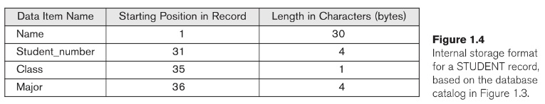

# Capítulo 1: Bases de Datos y Usuarios de Bases de Datos

**Fuente: Elmasri, R., & Navathe, S. B. (2016). Databases and database users. In *Fundamentals of database systems* (pp. 3-29). Pearson.**

Las bases de datos y los sistemas de bases de datos son un componente esencial de la vida en la sociedad moderna: la mayoría de nosotros nos encontramos con varias actividades cada día que involucran alguna interacción con una base de datos. Por ejemplo, si vamos al banco a depositar o retirar fondos, si hacemos una reservación de hotel o de aerolínea, si accedemos a un catálogo bibliográfico computarizado para buscar un ítem bibliográfico, o si compramos algo en línea —como un libro, un juguete o una computadora—, es muy probable que nuestras actividades involucren a alguien o a algún programa de computadora accediendo a una base de datos. Incluso la compra de artículos en un supermercado a menudo actualiza automáticamente la base de datos que contiene el inventario de artículos de abarrotes.

Estas interacciones son ejemplos de lo que podemos llamar aplicaciones tradicionales de bases de datos, en las cuales la mayor parte de la información que se almacena y accede es textual o numérica. En los últimos años, los avances tecnológicos han llevado a aplicaciones emocionantes y nuevas de los sistemas de bases de datos. La proliferación de sitios web de redes sociales, como Facebook, Twitter y Flickr, entre muchos otros, ha requerido la creación de enormes bases de datos que almacenan datos no tradicionales, como publicaciones, tweets, imágenes y clips de video. Se han creado nuevos tipos de sistemas de bases de datos, a menudo denominados sistemas de almacenamiento de big data o sistemas NOSQL (Not Only SQL), para gestionar datos para aplicaciones de redes sociales. Estos tipos de sistemas también son utilizados por empresas como Google, Amazon y Yahoo para gestionar los datos requeridos en sus motores de búsqueda web, así como para proporcionar almacenamiento en la nube (cloud storage), mediante el cual se proporciona a los usuarios capacidades de almacenamiento en la web para gestionar todo tipo de datos, incluidos documentos, programas, imágenes, videos y correos electrónicos. Presentaremos una visión general de estos nuevos tipos de sistemas de bases de datos en el Capítulo 24.

Ahora mencionamos algunas otras aplicaciones de las bases de datos. La amplia disponibilidad de tecnología de fotografía y video en teléfonos celulares y otros dispositivos ha hecho posible [p. 4] almacenar imágenes, clips de audio y transmisiones de video de forma digital. Estos tipos de archivos se están convirtiendo en un componente importante de las bases de datos multimedia (multimedia databases). Los sistemas de información geográfica (Geographic Information Systems, GIS) pueden almacenar y analizar mapas, datos meteorológicos e imágenes satelitales. Los almacenes de datos (data warehouses) y los sistemas de procesamiento analítico en línea (Online Analytical Processing, OLAP) se utilizan en muchas empresas para extraer y analizar información empresarial útil a partir de bases de datos muy grandes para apoyar la toma de decisiones. La tecnología de bases de datos en tiempo real (real-time) y de bases de datos activas (active database technology) se utiliza para controlar procesos industriales y de manufactura. Y las técnicas de búsqueda en bases de datos (search techniques) se están aplicando a la World Wide Web para mejorar la búsqueda de información que necesitan los usuarios que navegan por Internet.

Para comprender los fundamentos de la tecnología de bases de datos, sin embargo, debemos comenzar desde lo básico de las aplicaciones tradicionales de bases de datos. En la Sección 1.1 comenzamos definiendo una base de datos y luego explicamos otros términos básicos. En la Sección 1.2, proporcionamos un ejemplo sencillo de una base de datos UNIVERSITY para ilustrar nuestra discusión. La Sección 1.3 describe algunas de las características principales de los sistemas de bases de datos, y las Secciones 1.4 y 1.5 categorizan los tipos de personal cuyos trabajos implican usar e interactuar con sistemas de bases de datos. Las Secciones 1.6, 1.7 y 1.8 ofrecen una discusión más exhaustiva de las diversas capacidades proporcionadas por los sistemas de bases de datos y analizan algunas aplicaciones típicas de bases de datos. La Sección 1.9 resume el capítulo.

El lector que desee una introducción rápida a los sistemas de bases de datos puede estudiar las Secciones 1.1 a 1.5, luego saltar o revisar las Secciones 1.6 a 1.8 y continuar con el Capítulo 2.

## 1.1 Introducción

Las bases de datos y la tecnología de bases de datos han tenido un impacto importante en el creciente uso de las computadoras. Es justo decir que las bases de datos juegan un papel crítico en casi todas las áreas donde se utilizan computadoras, incluidos negocios, comercio electrónico, redes sociales, ingeniería, medicina, genética, derecho, educación y ciencias de la información. La palabra "base de datos" se usa tan comúnmente que debemos comenzar definiendo qué es una base de datos. Nuestra definición inicial es bastante general.

**Una base de datos es una colección de datos relacionados.**¹ Por *datos*, entendemos hechos conocidos que pueden registrarse y que tienen un significado implícito. Por ejemplo, considere los nombres, números telefónicos y direcciones de las personas que conoce. Hoy en día, estos datos se almacenan típicamente en teléfonos móviles, que tienen su propio software sencillo de bases de datos. Estos datos también pueden registrarse en una agenda indexada o almacenarse en un disco duro, utilizando una computadora personal y software como Microsoft Access o Excel. Esta colección de datos relacionados con un significado implícito es una base de datos.

La definición precedente de base de datos es bastante general; por ejemplo, podemos considerar que la colección de palabras que conforman esta página de texto son datos relacionados y, por lo tanto, constituyen una base de datos. Sin embargo, el uso común del término "base de datos" suele ser más restringido. Una base de datos tiene las siguientes propiedades implícitas:

-   **Una base de datos representa algún aspecto del mundo real**, a veces llamado el *miniworld* o el *universo de discurso* (Universe of Discourse, UoD). Los cambios en el miniworld se reflejan en la base de datos.
-   **Una base de datos es una colección lógicamente coherente de datos con algún significado inherente.** Una colección aleatoria de datos no puede denominarse correctamente como una base de datos.
-   **Una base de datos se diseña, construye y puebla con datos para un propósito específico.** Tiene un grupo de usuarios previsto y algunas aplicaciones preconcebidas en las que estos usuarios están interesados.

En otras palabras, una base de datos tiene alguna fuente de la cual se derivan los datos, algún grado de interacción con eventos del mundo real y una audiencia que está activamente interesada en sus contenidos. Los usuarios finales de una base de datos pueden realizar transacciones comerciales (por ejemplo, un cliente compra una cámara) o pueden ocurrir eventos (por ejemplo, un empleado tiene un bebé) que provocan cambios en la información de la base de datos. Para que una base de datos sea precisa y confiable en todo momento, debe ser un reflejo verdadero del miniworld que representa; por lo tanto, los cambios deben reflejarse en la base de datos lo antes posible.

Una base de datos puede ser de cualquier tamaño y complejidad. Por ejemplo, la lista de nombres y direcciones mencionada anteriormente puede consistir en solo unos pocos cientos de registros, cada uno con una estructura simple. Por otro lado, el catálogo computarizado de una biblioteca grande puede contener medio millón de entradas organizadas bajo diferentes categorías —por apellido del autor principal, por tema, por título del libro—, con cada categoría organizada alfabéticamente. Una base de datos de tamaño y complejidad aún mayor sería mantenida por una empresa de redes sociales como Facebook, que tiene más de mil millones de usuarios. La base de datos debe mantener información sobre qué usuarios están relacionados entre sí como amigos, las publicaciones de cada usuario, qué usuarios tienen permiso para ver cada publicación y una gran cantidad de otros tipos de información necesarios para el correcto funcionamiento de su sitio web. Para tales sitios web, se necesita un gran número de bases de datos para llevar un registro de la información en constante cambio requerida por el sitio web de redes sociales.

Un ejemplo de una base de datos comercial grande es Amazon.com. Contiene datos para más de 60 millones de usuarios activos y millones de libros, CDs, videos, DVDs, juegos, electrónicos, ropa y otros artículos. La base de datos ocupa más de 42 terabytes (un terabyte es 10¹² bytes de almacenamiento) y se almacena en cientos de computadoras (llamadas servidores). Millones de visitantes acceden a Amazon.com cada día y utilizan la base de datos para realizar compras. La base de datos se actualiza continuamente a medida que se agregan nuevos libros y otros artículos al inventario, y las cantidades de existencias se actualizan a medida que se realizan las transacciones de compra.

Una base de datos puede generarse y mantenerse manualmente o puede ser computarizada. Por ejemplo, un catálogo de tarjetas de biblioteca es una base de datos que puede crearse y mantenerse manualmente. Una base de datos computarizada puede crearse y mantenerse ya sea por un grupo de programas de aplicación escritos específicamente para esa tarea o por un [p. 6] **sistema de gestión de bases de datos** (Database Management System, DBMS). Por supuesto, en este texto solo nos ocupamos de bases de datos computarizadas.

**Un sistema de gestión de bases de datos (DBMS)** es un sistema computarizado que permite a los usuarios crear y mantener una base de datos. El DBMS es un sistema de software de propósito general que facilita los procesos de definir, construir, manipular y compartir bases de datos entre diversos usuarios y aplicaciones. **Definir** una base de datos implica especificar los tipos de datos, estructuras y restricciones de los datos que se almacenarán en la base de datos. La definición de la base de datos o la información descriptiva también se almacena por el DBMS en forma de un catálogo o diccionario de base de datos; se denomina **metadatos** (meta-data). **Construir** la base de datos es el proceso de almacenar los datos en algún medio de almacenamiento controlado por el DBMS. **Manipular** una base de datos incluye funciones como consultar la base de datos para recuperar datos específicos, actualizar la base de datos para reflejar cambios en el miniworld y generar reportes a partir de los datos. **Compartir** una base de datos permite que múltiples usuarios y programas accedan a la base de datos simultáneamente.

Un programa de aplicación accede a la base de datos enviando consultas o solicitudes de datos al DBMS. Una **consulta**² típicamente provoca que se recuperen algunos datos; una **transacción** puede provocar que se lean algunos datos y que se escriban algunos datos en la base de datos.

Otras funciones importantes proporcionadas por el DBMS incluyen proteger la base de datos y mantenerla durante un largo período de tiempo. La protección incluye protección del sistema contra fallas de hardware o software (o caídas) y protección de seguridad contra acceso no autorizado o malicioso. Una base de datos grande típica puede tener un ciclo de vida de muchos años, por lo que el DBMS debe poder mantener el sistema de bases de datos permitiendo que el sistema evolucione a medida que cambian los requisitos con el tiempo.

No es absolutamente necesario utilizar software de DBMS de propósito general para implementar una base de datos computarizada. Es posible escribir un conjunto personalizado de programas para crear y mantener la base de datos, creando efectivamente un software de DBMS de propósito especial para una aplicación específica, como reservaciones de aerolíneas. En cualquier caso —ya sea que utilicemos un DBMS de propósito general o no—, se despliega una cantidad considerable de software complejo. De hecho, la mayoría de los DBMS son sistemas de software muy complejos.

Para completar nuestras definiciones iniciales, llamaremos a la base de datos y al software del DBMS conjuntamente un **sistema de bases de datos**. La Figura 1.1 ilustra algunos de los conceptos que hemos discutido hasta ahora.

## 1.2 Un Ejemplo

Consideremos un ejemplo sencillo con el que la mayoría de los lectores pueden estar familiarizados: una base de datos UNIVERSITY para mantener información concerniente a estudiantes, cursos y calificaciones en un entorno universitario. La Figura 1.2 muestra la estructura de la base de datos y algunos registros de datos de muestra.

La base de datos está organizada como cinco archivos, cada uno de los cuales [p. 7] almacena registros de datos del mismo tipo.³ El archivo STUDENT almacena datos sobre cada estudiante, el archivo COURSE almacena datos sobre cada curso, el archivo SECTION almacena datos sobre cada sección de un curso, el archivo GRADE_REPORT almacena las calificaciones que los estudiantes reciben en las diversas secciones que han completado, y el archivo PREREQUISITE almacena los prerrequisitos de cada curso.

Para definir esta base de datos, debemos especificar la estructura de los registros de cada archivo especificando los diferentes tipos de elementos de datos que se almacenarán en cada registro. En la Figura 1.2, cada registro STUDENT incluye datos para representar el Nombre (Name), Número_de_estudiante (Student_number), Clase (Class, como freshman o '1', sophomore o '2', etc.) y Especialidad (Major, como mathematics o 'MATH' y computer science o 'CS') del estudiante; cada registro COURSE incluye datos para representar el Nombre_del_curso (Course_name), Número_del_curso (Course_number), Horas_crédito (Credit_hours) y Departamento (Department, el departamento que ofrece el curso), y así sucesivamente. También debemos especificar un tipo de datos para cada elemento de datos dentro de un registro. Por ejemplo, podemos especificar que Name de STUDENT es una cadena de caracteres alfabéticos, Student_number de STUDENT es un entero, y Grade de GRADE_REPORT es un solo carácter del conjunto {'A', 'B', 'C', 'D', 'F', 'I'}. También podemos usar un esquema de codificación para representar los valores de un elemento de datos. Por ejemplo, en la Figura 1.2 representamos la Class de un STUDENT como 1 para freshman, 2 para sophomore, 3 para junior, 4 para senior y 5 para estudiante de posgrado.

Para construir la base de datos UNIVERSITY, almacenamos datos para representar a cada estudiante, curso, sección, reporte de calificaciones y prerrequisito como un registro en el archivo apropiado. Observe que los registros en los diversos archivos pueden estar relacionados. Por ejemplo, el registro de Smith en el archivo STUDENT está relacionado con dos registros en el archivo GRADE_REPORT que especifican las calificaciones de Smith en dos secciones. De manera similar, cada registro en el archivo PREREQUISITE relaciona dos registros de curso: uno que representa el curso y otro que representa el prerrequisito. La mayoría de las bases de datos de tamaño mediano y grande incluyen muchos tipos de registros y tienen muchas relaciones entre los registros.

La manipulación de la base de datos implica consultas y actualizaciones. Ejemplos de consultas son los siguientes: - Recuperar el expediente académico (transcript) —una lista de todos los cursos y calificaciones— de 'Smith' - Listar los nombres de los estudiantes que tomaron la sección del curso 'Database' ofrecida en otoño de 2008 y sus calificaciones en esa sección - Listar los prerrequisitos del curso 'Database'

Ejemplos de actualizaciones incluyen lo siguiente: - Cambiar la clase de 'Smith' a sophomore - Crear una nueva sección para el curso 'Database' para este semestre - Ingresar una calificación de 'A' para 'Smith' en la sección 'Database' del semestre pasado

Estas consultas y actualizaciones informales deben especificarse con precisión en el lenguaje de consultas del DBMS antes de que puedan procesarse.

En esta etapa, es útil describir la base de datos como parte de un emprendimiento más amplio conocido como un **sistema de información** dentro de una organización. El departamento de Tecnologías de la Información (Information Technology, IT) dentro de una organización diseña y mantiene un sistema de información que consiste en diversas computadoras, sistemas de almacenamiento, software de aplicación y bases de datos. El diseño de una nueva aplicación para una base de datos existente o el diseño de una base de datos completamente nueva comienza con una fase llamada **especificación y análisis de requisitos**. Estos requisitos se documentan en detalle y se transforman en un **diseño conceptual** que puede representarse y manipularse utilizando algunas herramientas computarizadas para que pueda mantenerse, modificarse y transformarse fácilmente en una implementación de base de datos. (Presentaremos un modelo llamado modelo Entidad-Relación en el Capítulo 3 que se utiliza para este propósito.) El diseño se traduce luego a un **diseño lógico** que puede expresarse en un modelo de datos implementado en un DBMS comercial. (Se discuten varios tipos de DBMS a lo largo del texto, con énfasis en los DBMS relacionales en los Capítulos 5 a 9.) La etapa final es el **diseño físico**, durante el cual se proporcionan especificaciones adicionales para almacenar y acceder a la base de datos. El diseño de la base de datos se implementa, se puebla con datos reales y se mantiene continuamente para reflejar el estado del miniworld.

## 1.3 Características del Enfoque de Bases de Datos

Varias características distinguen el enfoque de bases de datos del enfoque mucho más antiguo de escribir programas personalizados para acceder a datos almacenados en archivos. En el procesamiento tradicional de archivos, cada usuario define e implementa los archivos necesarios para una aplicación de software específica como parte de la programación de la aplicación. Por ejemplo, un usuario, la oficina de reporte de calificaciones, puede mantener archivos sobre estudiantes y sus calificaciones. Los programas para imprimir el expediente académico de un estudiante y para ingresar nuevas calificaciones se implementan como parte de la aplicación. Un segundo usuario, la oficina de contabilidad, puede llevar un registro de las cuotas de los estudiantes y sus pagos. Aunque ambos usuarios están interesados en datos sobre estudiantes, cada usuario mantiene archivos separados —y programas para manipular estos archivos— porque cada uno requiere algunos datos no disponibles en los archivos del otro usuario. Esta redundancia en la definición y almacenamiento de datos resulta en desperdicio de espacio de almacenamiento y en esfuerzos redundantes para mantener datos comunes actualizados.

En el enfoque de bases de datos, un único repositorio mantiene datos que se definen una vez y luego son accedidos por diversos usuarios repetidamente a través de consultas, transacciones y programas de aplicación. Las características principales del enfoque de bases de datos versus el enfoque de procesamiento de archivos son las siguientes:

-   **Naturaleza autodescriptiva de un sistema de bases de datos**
-   **Aislamiento entre programas y datos, y abstracción de datos**
-   **Soporte de múltiples vistas de los datos**
-   **Compartición de datos y procesamiento de transacciones multiusuario**

Describimos cada una de estas características en una sección separada. Discutiremos características adicionales de los sistemas de bases de datos en las Secciones 1.6 a 1.8.

### 1.3.1 Naturaleza Autodescriptiva de un Sistema de Bases de Datos

Una característica fundamental del enfoque de bases de datos es que el sistema de bases de datos contiene no solo la base de datos en sí, sino también una definición o descripción completa de la estructura y restricciones de la base de datos. Esta definición se almacena en el catálogo del DBMS, que contiene información como la estructura de cada archivo, el tipo y formato de almacenamiento de cada elemento de datos, y diversas restricciones sobre los datos. La información almacenada en el catálogo se denomina **metadatos** (meta-data), y describe la estructura de la base de datos primaria (Figura 1.1). Es importante notar que algunos tipos más nuevos de sistemas de bases de datos, conocidos como sistemas NOSQL, no requieren metadatos. Más bien, los datos se almacenan como datos autodescriptivos que incluyen los nombres de los elementos de datos y los valores de los datos juntos en una sola estructura (ver Capítulo 24).

El catálogo es utilizado por el software del DBMS y también por los usuarios de bases de datos que necesitan información sobre la estructura de la base de datos. Un paquete de software de DBMS de propósito general no está escrito para una aplicación de base de datos específica. Por lo tanto, debe referirse al catálogo para conocer la estructura de los archivos en una base de datos específica, como el tipo y formato de los datos que accederá. El software del DBMS debe funcionar igualmente bien con cualquier número de aplicaciones de bases de datos —por ejemplo, una base de datos universitaria, una base de datos bancaria o una base de datos de una empresa— siempre que la definición de la base de datos se almacene en el catálogo.

En el procesamiento tradicional de archivos, la definición de datos es típicamente parte de los propios programas de aplicación. Por lo tanto, estos programas están restringidos a trabajar con solo una base de datos específica, cuya estructura se declara en los programas de aplicación. Por ejemplo, un programa de aplicación escrito en C++ puede tener declaraciones de struct o class. Mientras que el software de procesamiento de archivos puede acceder solo a bases de datos específicas, el software de DBMS puede acceder a diversas bases de datos extrayendo las definiciones de la base de datos del catálogo y utilizando estas definiciones.

Para el ejemplo mostrado en la Figura 1.2, el catálogo del DBMS almacenará las definiciones de todos los archivos mostrados. La Figura 1.3 muestra algunas entradas en un catálogo de base de datos.

Cada vez que se realiza una solicitud para acceder, digamos, al Name de un registro STUDENT, el software del DBMS se refiere al catálogo para determinar la estructura del archivo STUDENT y la posición y tamaño del elemento de datos Name dentro de un registro STUDENT. Por el contrario, en una aplicación típica de procesamiento de archivos, la estructura del archivo y, en el caso extremo, la ubicación exacta de Name dentro de un registro STUDENT ya están codificadas dentro de cada programa que accede a este elemento de datos.

### 1.3.2 Aislamiento entre Programas y Datos, y Abstracción de Datos

En el procesamiento tradicional de archivos, la estructura de los archivos de datos está incrustada en los programas de aplicación, por lo que cualquier cambio en la estructura de un archivo puede requerir cambiar todos los programas que acceden a ese archivo. Por el contrario, los programas de acceso al DBMS no requieren tales cambios en la mayoría de los casos. La estructura de los archivos de datos se almacena en el catálogo del DBMS por separado de los programas de acceso. Llamamos a esta propiedad **independencia programa-datos** (program-data independence).

Por ejemplo, un programa de acceso a archivos puede escribirse de tal manera que pueda acceder solo a registros STUDENT de la estructura mostrada en la Figura 1.4. 

Si queremos agregar otro dato a cada registro STUDENT, digamos el Birth_date, tal programa ya no funcionará y deberá cambiarse. Por el contrario, en un entorno de DBMS, solo necesitamos cambiar la descripción de los registros STUDENT en el catálogo (Figura 1.3) para reflejar la inclusión del nuevo elemento de datos Birth_date; no se cambian programas. La próxima vez que un programa del DBMS se refiera al catálogo, se accederá y utilizará la nueva estructura de los registros STUDENT.

En algunos tipos de sistemas de bases de datos, como los sistemas orientados a objetos y objeto-relacionales (ver Capítulo 12), los usuarios pueden definir operaciones sobre los datos como parte de las definiciones de la base de datos. Una **operación** (también llamada función o método) se especifica en dos partes. La **interfaz** (o firma/signature) de una operación incluye el nombre de la operación y los tipos de datos de sus argumentos (o parámetros). La **implementación** (o método) de la operación se especifica por separado y puede cambiarse sin afectar la interfaz. Los programas de aplicación de usuario pueden operar sobre los datos invocando estas operaciones a través de sus nombres y argumentos, independientemente de cómo se implementen las operaciones. Esto puede denominarse **independencia programa-operación** (program-operation independence).

La característica que permite la independencia programa-datos y la independencia programa-operación se denomina **abstracción de datos** (data abstraction). Un DBMS proporciona a los usuarios una representación conceptual de los datos que no incluye muchos de los detalles de cómo se almacenan los datos o cómo se implementan las operaciones. Informalmente, un **modelo de datos** es un tipo de abstracción de datos que se utiliza para proporcionar esta representación conceptual. El modelo de datos utiliza conceptos lógicos, como objetos, sus propiedades y sus interrelaciones, que pueden ser más fáciles de entender para la mayoría de los usuarios que los conceptos de almacenamiento computacional. Por lo tanto, el modelo de datos oculta detalles de almacenamiento e implementación que no son de interés para la mayoría de los usuarios de bases de datos.

Observando el ejemplo en las Figuras 1.2 y 1.3, la implementación interna del archivo STUDENT puede definirse por su longitud de registro —el número de caracteres (bytes) en cada registro— y cada elemento de datos puede especificarse por su byte inicial dentro de un registro y su longitud en bytes. El registro STUDENT se representaría así como se muestra en la Figura 1.4. Pero un usuario típico de base de datos no está preocupado por la ubicación de cada elemento de datos dentro de un registro o su longitud; más bien, al usuario le preocupa que cuando se hace una referencia a Name de STUDENT, se devuelva el valor correcto. Una representación conceptual de los registros STUDENT se muestra en la Figura 1.2. Muchos otros detalles de la organización del almacenamiento de archivos —como las rutas de acceso especificadas en un archivo— pueden ocultarse a los usuarios de bases de datos por el DBMS; discutimos detalles de almacenamiento en los Capítulos 16 y 17.

En el enfoque de bases de datos, la estructura detallada y la organización de cada archivo se almacenan en el catálogo. Los usuarios de bases de datos y los programas de aplicación se refieren a la representación conceptual de los archivos, y el DBMS extrae los detalles del almacenamiento de archivos del catálogo cuando estos son necesarios por los módulos de acceso a archivos del DBMS. Pueden utilizarse muchos modelos de datos para proporcionar esta abstracción de datos a los usuarios de bases de datos. Una parte importante de este texto está dedicada a presentar diversos modelos de datos y los conceptos que utilizan para abstraer la representación de datos.

En las bases de datos orientadas a objetos y objeto-relacionales, el proceso de abstracción incluye no solo la estructura de datos sino también las operaciones sobre los datos. Estas operaciones proporcionan una abstracción de actividades del miniworld comúnmente entendidas por los usuarios. Por ejemplo, una operación CALCULATE_GPA puede aplicarse a un objeto STUDENT para calcular el promedio de calificaciones. Tales operaciones pueden ser invocadas por las consultas del usuario o programas de aplicación sin tener que conocer los detalles de cómo se implementan las operaciones.

### 1.3.3 Soporte de Múltiples Vistas de los Datos

Una base de datos típicamente tiene muchos tipos de usuarios, cada uno de los cuales puede requerir una perspectiva o vista diferente de la base de datos. Una vista puede ser un subconjunto de la base de datos o puede contener datos virtuales que se derivan de los archivos de la base de datos pero que no se almacenan explícitamente. Algunos usuarios pueden no necesitar estar conscientes de si los datos a los que se refieren se almacenan o se derivan. Un DBMS multiusuario cuyos usuarios tienen una variedad de aplicaciones distintas debe proporcionar facilidades para definir múltiples vistas. Por ejemplo, un usuario de la base de datos de la Figura 1.2 puede estar interesado solo en acceder e imprimir el expediente académico de cada estudiante; la vista para este usuario se muestra en la Figura 1.5(a). Un segundo usuario, que está interesado solo en verificar que los estudiantes hayan tomado todos los prerrequisitos de cada curso para el cual el estudiante se registra, puede requerir la vista mostrada en la Figura 1.5(b).

 *Figura 1.5. Dos vistas derivadas de la base de datos de la Figura 1.2. (a) La vista TRANSCRIPT. (b) La vista COURSE_PREREQUISITES.*

### 1.3.4 Compartición de Datos y Procesamiento de Transacciones Multiusuario

Un DBMS multiusuario, como su nombre lo implica, debe permitir que múltiples usuarios accedan a la base de datos al mismo tiempo. Esto es esencial si los datos para múltiples aplicaciones van a integrarse y mantenerse en una sola base de datos. El DBMS debe incluir **software de control de concurrencia** (concurrency control software) para asegurar que varios usuarios que intentan actualizar los mismos datos lo hagan de manera controlada, de modo que el resultado de las actualizaciones sea correcto. Por ejemplo, cuando varios agentes de reservaciones intentan asignar un asiento en un vuelo de aerolínea, el DBMS debe asegurar que cada asiento pueda ser accedido por solo un agente a la vez para asignarlo a un pasajero. Estos tipos de aplicaciones se denominan generalmente aplicaciones de **procesamiento de transacciones en línea** (Online Transaction Processing, OLTP). Un papel fundamental del software de DBMS multiusuario es asegurar que las transacciones concurrentes operen correctamente y de manera eficiente.

El concepto de una **transacción** se ha vuelto central para muchas aplicaciones de bases de datos. Una transacción es un programa o proceso en ejecución que incluye uno o más accesos a la base de datos, como lectura o actualización de registros de base de datos. Se supone que cada transacción ejecuta un acceso lógicamente correcto a la base de datos si se ejecuta en su totalidad sin interferencia de otras transacciones. El DBMS debe hacer cumplir varias propiedades de transacción. La **propiedad de aislamiento** (isolation property) asegura que cada transacción parezca ejecutarse en aislamiento de otras transacciones, aunque cientos de transacciones puedan ejecutarse concurrentemente. La **propiedad de atomicidad** (atomicity property) asegura que todas las operaciones de base de datos en una transacción se ejecuten o ninguna se ejecute. Discutimos las transacciones en detalle en la Parte 9.

Las características precedentes son importantes para distinguir un DBMS del software tradicional de procesamiento de archivos. En la Sección 1.6 discutimos características adicionales que caracterizan a un DBMS. Primero, sin embargo, categorizamos los diferentes tipos de personas que trabajan en un entorno de sistema de bases de datos.

## 1.4 Actores en la Escena

Para una base de datos personal pequeña, como la lista de direcciones discutida en la Sección 1.1, una persona típicamente define, construye y manipula la base de datos, y no hay compartición. Sin embargo, en organizaciones grandes, muchas personas están involucradas en el diseño, uso y mantenimiento de una base de datos grande con cientos o miles de usuarios. En esta sección identificamos a las personas cuyos trabajos implican el uso diario de una base de datos grande; las llamamos los **actores en la escena** (actors on the scene). En la Sección 1.5 consideramos a las personas que pueden llamarse **trabajadores detrás de escena** (workers behind the scene) —aquellos que trabajan para mantener el entorno del sistema de bases de datos pero que no están activamente interesados en los contenidos de la base de datos como parte de su trabajo diario.

### 1.4.1 Administradores de Bases de Datos

En cualquier organización donde muchas personas usan los mismos recursos, existe la necesidad de un administrador principal para supervisar y gestionar estos recursos. En un entorno de bases de datos, el recurso principal es la base de datos en sí, y el recurso secundario es el DBMS y el software relacionado. Administrar estos recursos es responsabilidad del **administrador de bases de datos** (Database Administrator, DBA). El DBA es responsable de autorizar el acceso a la base de datos, coordinar y monitorear su uso, y adquirir recursos de software y hardware según sea necesario. El DBA es responsable de problemas como brechas de seguridad y tiempos de respuesta deficientes del sistema. En organizaciones grandes, el DBA es asistido por un personal que lleva a cabo estas funciones.

### 1.4.2 Diseñadores de Bases de Datos

Los diseñadores de bases de datos son responsables de identificar los datos que se almacenarán en la base de datos y de elegir estructuras apropiadas para representar y almacenar estos datos. Estas tareas se emprenden principalmente antes de que la base de datos se implemente y pueble realmente con datos. Es responsabilidad de los diseñadores de bases de datos comunicarse con todos los usuarios prospectivos de la base de datos para comprender sus requisitos y crear un diseño que cumpla con estos requisitos. En muchos casos, los diseñadores están en el personal del DBA y pueden asignarse otras responsabilidades de personal después de que se complete el diseño de la base de datos. Los diseñadores de bases de datos típicamente interactúan con cada grupo potencial de usuarios y desarrollan vistas de la base de datos que cumplen con los requisitos de datos y procesamiento de estos grupos. Cada vista se analiza e integra luego con las vistas de otros grupos de usuarios. El diseño final de la base de datos debe ser capaz de soportar los requisitos de todos los grupos de usuarios.

### 1.4.3 Usuarios Finales

Los usuarios finales son las personas cuyos trabajos requieren acceso a la base de datos para consultar, actualizar y generar reportes; la base de datos existe principalmente para su uso. Hay varias categorías de usuarios finales:

-   **Usuarios finales casuales** acceden ocasionalmente a la base de datos, pero pueden necesitar información diferente cada vez. Utilizan una interfaz sofisticada de consulta de bases de datos para especificar sus solicitudes y son típicamente gerentes de nivel medio o alto u otros navegadores ocasionales.

-   **Usuarios finales ingenuos o paramétricos** constituyen una porción considerable de los usuarios finales de bases de datos. Su función laboral principal gira en torno a consultar y actualizar constantemente la base de datos, utilizando tipos estándar de consultas y actualizaciones —llamadas **transacciones enlatadas** (canned transactions)— que han sido cuidadosamente programadas y probadas. Muchas de estas tareas están ahora disponibles como aplicaciones móviles (apps) para usar con dispositivos móviles. Las tareas que realizan estos usuarios son variadas. Algunos ejemplos son:

    -   Clientes y cajeros de bancos verifican saldos de cuentas y registran retiros y depósitos.
    -   Agentes o clientes de reservaciones para aerolíneas, hoteles y compañías de alquiler de automóviles verifican disponibilidad para una solicitud dada y hacen reservaciones.
    -   Empleados en estaciones de recepción para compañías de envío ingresan identificaciones de paquetes mediante códigos de barras e información descriptiva a través de botones para actualizar una base de datos central de paquetes recibidos y en tránsito.
    -   Usuarios de redes sociales publican y leen ítems en sitios web de redes sociales.

-   **Usuarios finales sofisticados** incluyen ingenieros, científicos, analistas de negocios y otros que se familiarizan completamente con las facilidades del DBMS para implementar sus propias aplicaciones para cumplir con sus requisitos complejos.

-   **Usuarios independientes** mantienen bases de datos personales utilizando paquetes de programas listos para usar que proporcionan interfaces fáciles de usar basadas en menús o gráficos. Un ejemplo es el usuario de un paquete de software financiero que almacena una variedad de datos financieros personales.

Un DBMS típico proporciona múltiples facilidades para acceder a una base de datos. Los usuarios finales ingenuos necesitan aprender muy poco sobre las facilidades proporcionadas por el DBMS; simplemente deben comprender las interfaces de usuario de las aplicaciones móviles o transacciones estándar diseñadas e implementadas para su uso. Los usuarios casuales aprenden solo unas pocas facilidades que pueden usar repetidamente. Los usuarios sofisticados intentan aprender la mayoría de las facilidades del DBMS para lograr sus requisitos complejos. Los usuarios independientes típicamente se vuelven muy competentes en el uso de un paquete de software específico.

### 1.4.4 Analistas de Sistemas y Programadores de Aplicaciones (Ingenieros de Software)

Los analistas de sistemas determinan los requisitos de los usuarios finales, especialmente usuarios finales ingenuos y paramétricos, y desarrollan especificaciones para transacciones enlatadas estándar que cumplen con estos requisitos. Los programadores de aplicaciones implementan estas especificaciones como programas; luego prueban, depuran, documentan y mantienen estas transacciones enlatadas. Tales analistas y programadores —comúnmente denominados **desarrolladores de software** o **ingenieros de software**— deben estar familiarizados con el rango completo de capacidades proporcionadas por el DBMS para realizar sus tareas.

## 1.5 Trabajadores detrás de la Escena

Además de aquellos que diseñan, usan y administran una base de datos, otros están asociados con el diseño, desarrollo y operación del software y entorno del sistema del DBMS. Estas personas típicamente no están interesadas en el contenido de la base de datos en sí. Las llamamos los **trabajadores detrás de la escena** (workers behind the scene), e incluyen las siguientes categorías:

-   **Diseñadores e implementadores de sistemas DBMS** diseñan e implementan los módulos e interfaces del DBMS como un paquete de software. Un DBMS es un sistema de software muy complejo que consiste en muchos componentes, o módulos, incluyendo módulos para implementar el catálogo, procesamiento de lenguaje de consultas, procesamiento de interfaces, acceso y buffering de datos, control de concurrencia, y manejo de recuperación y seguridad de datos. El DBMS debe interactuar con otro software del sistema, como el sistema operativo y compiladores para diversos lenguajes de programación.

-   **Desarrolladores de herramientas** diseñan e implementan herramientas —los paquetes de software que facilitan el modelado y diseño de bases de datos, el diseño de sistemas de bases de datos y el mejoramiento del rendimiento. Las herramientas son paquetes opcionales que a menudo se compran por separado. Incluyen paquetes para diseño de bases de datos, monitoreo de rendimiento, interfaces de lenguaje natural o gráficas, prototipado, simulación y generación de datos de prueba. En muchos casos, proveedores independientes de software desarrollan y comercializan estas herramientas.

-   **Operadores y personal de mantenimiento** (personal de administración de sistemas) son responsables de la operación y mantenimiento reales del entorno de hardware y software para el sistema de bases de datos.

Aunque estas categorías de trabajadores detrás de la escena son instrumentales para hacer que el sistema de bases de datos esté disponible para los usuarios finales, típicamente no utilizan los contenidos de la base de datos para sus propios propósitos.

## 1.6 Ventajas de Utilizar el Enfoque de DBMS

En esta sección discutimos algunas ventajas adicionales de utilizar un DBMS y las capacidades que un buen DBMS debería poseer. Estas capacidades son adicionales a las cuatro características principales discutidas en la Sección 1.3. El DBA debe utilizar estas capacidades para lograr una variedad de objetivos relacionados con el diseño, administración y uso de una base de datos multiusuario grande.

### 1.6.1 Control de Redundancia

En el desarrollo tradicional de software que utiliza procesamiento de archivos, cada grupo de usuarios mantiene sus propios archivos para manejar sus aplicaciones de procesamiento de datos. Por ejemplo, considere el ejemplo de la base de datos UNIVERSITY de la Sección 1.2; aquí, dos grupos de usuarios podrían ser el personal de registro de cursos y la oficina de contabilidad. En el enfoque tradicional, cada grupo mantiene independientemente archivos sobre estudiantes. La oficina de contabilidad mantiene datos sobre registro y información de facturación relacionada, mientras que la oficina de registro lleva un registro de los cursos y calificaciones de los estudiantes. Otros grupos pueden duplicar además algunos o todos los mismos datos en sus propios archivos.

Esta redundancia en almacenar los mismos datos múltiples veces conduce a varios problemas. Primero, existe la necesidad de realizar una única **actualización lógica** —como ingresar datos sobre un nuevo estudiante— múltiples veces: una vez por cada archivo donde se registran los datos del estudiante. Esto conduce a duplicación de esfuerzo. Segundo, se desperdicia espacio de almacenamiento cuando los mismos datos se almacenan repetidamente, y este problema puede ser serio para bases de datos grandes. Tercero, los archivos que representan los mismos datos pueden volverse inconsistentes. Esto puede suceder porque una actualización se aplica a algunos de los archivos pero no a otros. Incluso si una actualización —como agregar un nuevo estudiante— se aplica a todos los archivos apropiados, los datos concernientes al estudiante aún pueden ser inconsistentes porque las actualizaciones se aplican independientemente por cada grupo de usuarios. Por ejemplo, un grupo de usuarios puede ingresar la fecha de nacimiento de un estudiante erróneamente como 'JAN-19-1988', mientras que los otros grupos de usuarios pueden ingresar el valor correcto de 'JAN-29-1988'.

En el enfoque de bases de datos, las vistas de diferentes grupos de usuarios se integran durante el diseño de la base de datos. Idealmente, deberíamos tener un diseño de base de datos que almacene cada elemento de datos lógico —como el nombre o fecha de nacimiento de un estudiante— en solo un lugar en la base de datos. Esto se conoce como **normalización de datos** (data normalization), y asegura consistencia y ahorra espacio de almacenamiento (la normalización de datos se describe en la Parte 6 del texto).

Sin embargo, en la práctica, a veces es necesario utilizar **redundancia controlada** para mejorar el rendimiento de las consultas. Por ejemplo, podemos almacenar Student_name y Course_number de manera redundante en un archivo GRADE_REPORT (Figura 1.6(a)) porque cada vez que recuperamos un registro GRADE_REPORT, queremos recuperar el nombre del estudiante y el número del curso junto con la calificación, el número de estudiante y el identificador de sección. Al colocar todos los datos juntos, no tenemos que buscar en múltiples archivos para recopilar estos datos. Esto se conoce como **desnormalización** (denormalization). En tales casos, el DBMS debe tener la capacidad de controlar esta redundancia para prohibir inconsistencias entre los archivos. Esto puede hacerse verificando automáticamente que los valores Student_name–Student_number en cualquier registro GRADE_REPORT en la Figura 1.6(a) coincidan con uno de los valores Name–Student_number de un registro STUDENT (Figura 1.2). De manera similar, los valores Section_identifier–Course_number en GRADE_REPORT pueden verificarse contra registros SECTION. Tales verificaciones pueden especificarse al DBMS durante el diseño de la base de datos y hacerse cumplir automáticamente por el DBMS cada vez que se actualiza el archivo GRADE_REPORT. La Figura 1.6(b) muestra un registro GRADE_REPORT que es inconsistente con el archivo STUDENT en la Figura 1.2; este tipo de error puede ingresarse si la redundancia no se controla. ¿Puede decir qué parte es inconsistente?

### 1.6.2 Restricción de Acceso No Autorizado

Cuando múltiples usuarios comparten una base de datos grande, es probable que la mayoría de los usuarios no estén autorizados para acceder a toda la información en la base de datos. Por ejemplo, los datos financieros como salarios y bonos a menudo se consideran confidenciales, y solo las personas autorizadas tienen permiso para acceder a dichos datos. Además, algunos usuarios pueden tener permiso solo para recuperar datos, mientras que otros tienen permiso para recuperar y actualizar. Por lo tanto, el tipo de operación de acceso —recuperación o actualización— también debe controlarse. Típicamente, a los usuarios o grupos de usuarios se les asignan números de cuenta protegidos por contraseñas, que pueden usar para obtener acceso a la base de datos. Un DBMS debe proporcionar un **subsistema de seguridad y autorización**, que el DBA utiliza para crear cuentas y especificar restricciones de cuenta. Luego, el DBMS debe hacer cumplir estas restricciones automáticamente. Observe que podemos aplicar controles similares al software del DBMS. Por ejemplo, solo el personal del DBA puede tener permiso para usar cierto software privilegiado, como el software para crear nuevas cuentas. De manera similar, los usuarios paramétricos pueden tener permiso para acceder a la base de datos solo a través de las aplicaciones predefinidas o transacciones enlatadas desarrolladas para su uso. Discutimos la seguridad y autorización de bases de datos en el Capítulo 30.

### 1.6.3 Proporcionar Almacenamiento Persistente para Objetos de Programa

Las bases de datos pueden utilizarse para proporcionar almacenamiento persistente para objetos de programa y estructuras de datos. Esta es una de las razones principales de los sistemas de bases de datos orientados a objetos (ver Capítulo 12). Los lenguajes de programación típicamente tienen estructuras de datos complejas, como definiciones de structs o class en C++ o Java. Los valores de variables de programa u objetos se descartan una vez que termina un programa, a menos que el programador los almacene explícitamente en archivos permanentes, lo que a menudo implica convertir estas estructuras complejas en un formato adecuado para el almacenamiento en archivos. Cuando surge la necesidad de leer estos datos una vez más, el programador debe convertir del formato de archivo a la estructura de variable de programa u objeto. Los sistemas de bases de datos orientados a objetos son compatibles con lenguajes de programación como C++ y Java, y el software del DBMS realiza automáticamente cualquier conversión necesaria. Por lo tanto, un objeto complejo en C++ puede almacenarse permanentemente en un DBMS orientado a objetos. Se dice que tal objeto es **persistente**, ya que sobrevive a la terminación de la ejecución del programa y puede recuperarse directamente posteriormente por otro programa.

El almacenamiento persistente de objetos de programa y estructuras de datos es una función importante de los sistemas de bases de datos. Los sistemas de bases de datos tradicionales a menudo sufrían del llamado problema de **desajuste de impedancia** (impedance mismatch problem), ya que las estructuras de datos proporcionadas por el DBMS eran incompatibles con las estructuras de datos del lenguaje de programación. Los sistemas de bases de datos orientados a objetos típicamente ofrecen compatibilidad de estructuras de datos con uno o más lenguajes de programación orientados a objetos.

### 1.6.4 Proporcionar Estructuras de Almacenamiento y Técnicas de Búsqueda para Procesamiento Eficiente de Consultas

Los sistemas de bases de datos deben proporcionar capacidades para ejecutar eficientemente consultas y actualizaciones. Debido a que la base de datos se almacena típicamente en disco, el DBMS debe proporcionar estructuras de datos especializadas y técnicas de búsqueda para acelerar la búsqueda en disco de los registros deseados. Los archivos auxiliares llamados **índices** (indexes) a menudo se utilizan para este propósito. Los índices se basan típicamente en estructuras de datos de árbol o estructuras de datos de hash que se modifican adecuadamente para la búsqueda en disco. Para procesar los registros de base de datos necesarios por una consulta particular, esos registros deben copiarse del disco a la memoria principal. Por lo tanto, el DBMS a menudo tiene un módulo de buffering o caching que mantiene partes de la base de datos en buffers de memoria principal. En general, el sistema operativo es responsable del buffering de disco a memoria. Sin embargo, debido a que el buffering de datos es crucial para el rendimiento del DBMS, la mayoría de los DBMS realizan su propio buffering de datos.

El módulo de procesamiento y optimización de consultas del DBMS es responsable de elegir un plan de ejecución de consulta eficiente para cada consulta basado en las estructuras de almacenamiento existentes. La elección de qué índices crear y mantener es parte del diseño y ajuste físico de la base de datos, que es una de las responsabilidades del personal del DBA. Discutimos el procesamiento y optimización de consultas en la Parte 8 del texto.

### 1.6.5 Proporcionar Copias de Seguridad y Recuperación

Un DBMS debe proporcionar facilidades para recuperarse de fallas de hardware o software. El **subsistema de copia de seguridad y recuperación** (backup and recovery subsystem) del DBMS es responsable de la recuperación. Por ejemplo, si el sistema de computadora falla en medio de una transacción de actualización compleja, el subsistema de recuperación es responsable de asegurarse de que la base de datos se restaure al estado en que se encontraba antes de que la transacción comenzara a ejecutarse. La copia de seguridad en disco también es necesaria en caso de una falla catastrófica del disco. Discutimos la recuperación y copia de seguridad en el Capítulo 22.

### 1.6.6 Proporcionar Múltiples Interfaces de Usuario

Debido a que muchos tipos de usuarios con diversos niveles de conocimiento técnico utilizan una base de datos, un DBMS debe proporcionar una variedad de interfaces de usuario. Estas incluyen aplicaciones para usuarios móviles, lenguajes de consultas para usuarios casuales, interfaces de lenguaje de programación para programadores de aplicaciones, formularios y códigos de comando para usuarios paramétricos, e interfaces basadas en menús e interfaces de lenguaje natural para usuarios independientes. Tanto las interfaces de estilo de formulario como las interfaces basadas en menús se conocen comúnmente como **interfaces gráficas de usuario** (Graphical User Interfaces, GUIs). Existen muchos lenguajes y entornos especializados para especificar GUIs. Las capacidades para proporcionar interfaces GUI web a una base de datos —o habilitar una base de datos para la web— también son bastante comunes.

### 1.6.7 Representar Relaciones Complejas entre Datos

Una base de datos puede incluir numerosas variedades de datos que están interrelacionados de muchas maneras. Considere el ejemplo mostrado en la Figura 1.2. El registro de 'Brown' en el archivo STUDENT está relacionado con cuatro registros en el archivo GRADE_REPORT. De manera similar, cada registro de sección está relacionado con un registro de curso y con varios registros GRADE_REPORT —uno por cada estudiante que completó esa sección. Un DBMS debe tener la capacidad de representar una variedad de relaciones complejas entre los datos, definir nuevas relaciones a medida que surgen, y recuperar y actualizar datos relacionados de manera fácil y eficiente.

### 1.6.8 Hacer Cumplir Restricciones de Integridad

La mayoría de las aplicaciones de bases de datos tienen ciertas **restricciones de integridad** que deben cumplirse para los datos. Un DBMS debe proporcionar capacidades para definir y hacer cumplir estas restricciones. El tipo más simple de restricción de integridad implica especificar un tipo de datos para cada elemento de datos. Por ejemplo, en la Figura 1.3, especificamos que el valor del elemento de datos Class dentro de cada registro STUDENT debe ser un entero de un dígito y que el valor de Name debe ser una cadena de no más de 30 caracteres alfabéticos. Restringir el valor de Class entre 1 y 5 sería una restricción adicional que no se muestra en el catálogo actual. Un tipo más complejo de restricción que ocurre frecuentemente implica especificar que un registro en un archivo debe estar relacionado con registros en otros archivos. Por ejemplo, en la Figura 1.2, podemos especificar que cada registro de sección debe estar relacionado con un registro de curso. Esto se conoce como una **restricción de integridad referencial** (referential integrity constraint). Otro tipo de restricción especifica unicidad en valores de elementos de datos, como que cada registro de curso debe tener un valor único para Course_number. Esto se conoce como una **restricción de clave o unicidad** (key or uniqueness constraint). Estas restricciones se derivan del significado o semántica de los datos y del miniworld que representa. Es responsabilidad de los diseñadores de bases de datos identificar restricciones de integridad durante el diseño de la base de datos. Algunas restricciones pueden especificarse al DBMS y hacerse cumplir automáticamente. Otras restricciones pueden tener que verificarse mediante programas de actualización o en el momento de la entrada de datos. Para aplicaciones grandes típicas, es costumbre llamar a tales restricciones **reglas de negocio** (business rules).

Un elemento de datos puede ingresarse erróneamente y aún satisfacer las restricciones de integridad especificadas. Por ejemplo, si un estudiante recibe una calificación de 'A' pero se ingresa una calificación de 'C' en la base de datos, el DBMS no puede descubrir este error automáticamente porque 'C' es un valor válido para el tipo de datos Grade. Tales errores de entrada de datos solo pueden descubrirse manualmente (cuando el estudiante recibe la calificación y se queja) y corregirse posteriormente actualizando la base de datos. Sin embargo, una calificación de 'Z' sería rechazada automáticamente por el DBMS porque 'Z' no es un valor válido para el tipo de datos Grade. Cuando discutimos cada modelo de datos en capítulos subsiguientes, introduciremos reglas que pertenecen a ese modelo implícitamente. Por ejemplo, en el modelo Entidad-Relación en el Capítulo 3, una relación debe involucrar al menos dos entidades. Las reglas que pertenecen a un modelo de datos específico se denominan **reglas inherentes del modelo de datos** (inherent rules of the data model).

### 1.6.9 Permitir Inferencia y Acciones Usando Reglas y Disparadores

Algunos sistemas de bases de datos proporcionan capacidades para definir **reglas de deducción** para inferir nueva información a partir de los hechos almacenados en la base de datos. Tales sistemas se denominan **sistemas de bases de datos deductivas** (deductive database systems). Por ejemplo, puede haber reglas complejas en la aplicación del miniworld para determinar cuándo un estudiante está en libertad condicional académica. Estas pueden especificarse declarativamente como reglas, que cuando se compilan y mantienen por el DBMS pueden determinar todos los estudiantes en libertad condicional. En un DBMS tradicional, tendría que escribirse un código de programa procedural explícito para soportar tales aplicaciones. Pero si las reglas del miniworld cambian, generalmente es más conveniente cambiar las reglas de deducción declaradas que recodificar programas procedurales. En los sistemas de bases de datos relacionales de hoy, es posible asociar **disparadores** (triggers) con tablas. Un disparador es una forma de regla activada por actualizaciones a la tabla, lo que resulta en realizar algunas operaciones adicionales a otras tablas, enviar mensajes, etc. Los procedimientos más involucrados para hacer cumplir reglas se denominan popularmente **procedimientos almacenados** (stored procedures); se convierten en parte de la definición general de la base de datos y se invocan apropiadamente cuando se cumplen ciertas condiciones. Una funcionalidad más poderosa es proporcionada por los **sistemas de bases de datos activas** (active database systems), que proporcionan reglas activas que pueden iniciar automáticamente acciones cuando ocurren ciertos eventos y condiciones (ver Capítulo 26 para introducciones a bases de datos activas en la Sección 26.1 y bases de datos deductivas en la Sección 26.5).

### 1.6.10 Implicaciones Adicionales de Utilizar el Enfoque de Bases de Datos

Esta sección discute algunas implicaciones adicionales de utilizar el enfoque de bases de datos que pueden beneficiar a la mayoría de las organizaciones.

**Potencial para Hacer Cumplir Estándares.** El enfoque de bases de datos permite al DBA definir y hacer cumplir estándares entre los usuarios de bases de datos en una organización grande. Esto facilita la comunicación y cooperación entre diversos departamentos, proyectos y usuarios dentro de la organización. Los estándares pueden definirse para nombres y formatos de elementos de datos, formatos de visualización, estructuras de reportes, terminología, etc. El DBA puede hacer cumplir estándares en un entorno de base de datos centralizado más fácilmente que en un entorno donde cada grupo de usuarios tiene control de sus propios archivos de datos y software.

**Tiempo Reducido de Desarrollo de Aplicaciones.** Una característica de venta principal del enfoque de bases de datos es que desarrollar una nueva aplicación —como la recuperación de ciertos datos de la base de datos para imprimir un nuevo reporte— toma muy poco tiempo. Diseñar e implementar una base de datos multiusuario grande desde cero puede tomar más tiempo que escribir una sola aplicación de archivo especializada. Sin embargo, una vez que una base de datos está en funcionamiento, generalmente se requiere sustancialmente menos tiempo para crear nuevas aplicaciones utilizando las facilidades del DBMS. Se estima que el tiempo de desarrollo utilizando un DBMS es de un sexto a un cuarto del de un sistema de archivos.

**Flexibilidad.** Puede ser necesario cambiar la estructura de una base de datos a medida que cambian los requisitos. Por ejemplo, puede surgir un nuevo grupo de usuarios que necesita información no actualmente en la base de datos. En respuesta, puede ser necesario agregar un archivo a la base de datos o extender los elementos de datos en un archivo existente. Los DBMS modernos permiten ciertos tipos de cambios evolutivos a la estructura de la base de datos sin afectar los datos almacenados y los programas de aplicación existentes.

**Disponibilidad de Información Actualizada.** Un DBMS hace que la base de datos esté disponible para todos los usuarios. Tan pronto como se aplica la actualización de un usuario a la base de datos, todos los demás usuarios pueden ver inmediatamente esta actualización. Esta disponibilidad de información actualizada es esencial para muchas aplicaciones de procesamiento de transacciones, como sistemas de reservaciones o bases de datos bancarias, y es posible gracias a los subsistemas de control de concurrencia y recuperación de un DBMS.

**Economías de Escala.** El enfoque de DBMS permite la consolidación de datos y aplicaciones, reduciendo así la cantidad de superposición wasteful entre actividades de personal de procesamiento de datos en diferentes proyectos o departamentos, así como redundancias entre aplicaciones. Esto permite a toda la organización invertir en procesadores más potentes, dispositivos de almacenamiento o equipos de red, en lugar de que cada departamento compre su propio equipo (de menor rendimiento). Esto reduce los costos generales de operación y gestión.

## 1.7 Una Breve Historia de las Aplicaciones de Bases de Datos

Ahora ofrecemos una visión general histórica breve de las aplicaciones que utilizan DBMS y cómo estas aplicaciones proporcionaron el impulso para nuevos tipos de sistemas de bases de datos.

### 1.7.1 Aplicaciones Tempranas de Bases de Datos Utilizando Sistemas Jerárquicos y de Red

Muchas aplicaciones tempranas de bases de datos mantenían registros en organizaciones grandes como corporaciones, universidades, hospitales y bancos. En muchas de estas aplicaciones, había grandes números de registros de estructura similar. Por ejemplo, en una aplicación universitaria, se mantendría información similar para cada estudiante, cada curso, cada registro de calificación, etc. También había muchos tipos de registros y muchas interrelaciones entre ellos.

Uno de los problemas principales con los sistemas de bases de datos tempranos era la mezcla de relaciones conceptuales con el almacenamiento físico y la colocación de registros en disco. Por lo tanto, estos sistemas no proporcionaban suficientes capacidades de abstracción de datos e independencia programa-datos. Por ejemplo, los registros de calificaciones de un estudiante particular podían almacenarse físicamente junto al registro del estudiante. Aunque esto proporcionaba acceso muy eficiente para las consultas y transacciones originales para las cuales se diseñó la base de datos, no proporcionaba suficiente flexibilidad para acceder a registros eficientemente cuando se identificaban nuevas consultas y transacciones. En particular, nuevas consultas que requerían una organización de almacenamiento diferente para procesamiento eficiente eran bastante difíciles de implementar eficientemente. También era laborioso reorganizar la base de datos cuando se realizaban cambios a los requisitos de la aplicación.

Otra deficiencia de los sistemas tempranos era que proporcionaban solo interfaces de lenguaje de programación. Esto hacía que fuera costoso y que tomara mucho tiempo implementar nuevas consultas y transacciones, ya que tenían que escribirse, probarse y depurarse nuevos programas. La mayoría de estos sistemas de bases de datos se implementaron en computadoras mainframe grandes y costosas comenzando a mediados de la década de 1960 y continuando a través de las décadas de 1970 y 1980. Los tipos principales de sistemas tempranos se basaban en tres paradigmas principales: sistemas jerárquicos, sistemas basados en el modelo de red y sistemas de archivos invertidos.

### 1.7.2 Proporcionar Abstracción de Datos y Flexibilidad de Aplicación con Bases de Datos Relacionales

Las bases de datos relacionales se propusieron originalmente para separar el almacenamiento físico de datos de su representación conceptual y proporcionar una base matemática para la representación y consulta de datos. El modelo de datos relacional también introdujo lenguajes de consulta de alto nivel que proporcionaban una alternativa a las interfaces de lenguaje de programación, haciendo mucho más rápido escribir nuevas consultas. La representación relacional de datos se asemeja algo al ejemplo que presentamos en la Figura 1.2. Los sistemas relacionales se dirigieron inicialmente a las mismas aplicaciones que los sistemas anteriores, y proporcionaron flexibilidad para desarrollar nuevas consultas rápidamente y reorganizar la base de datos a medida que cambiaban los requisitos. Por lo tanto, la abstracción de datos y la independencia programa-datos mejoraron mucho en comparación con los sistemas anteriores.

Los sistemas relacionales experimentales tempranos desarrollados a finales de la década de 1970 y los sistemas de gestión de bases de datos relacionales comerciales (Relational Database Management Systems, RDBMS) introducidos a principios de la década de 1980 eran bastante lentos, ya que no utilizaban punteros de almacenamiento físico o colocación de registros para acceder a registros de datos relacionados. Con el desarrollo de nuevas técnicas de almacenamiento e indexación y mejor procesamiento y optimización de consultas, su rendimiento mejoró. Eventualmente, las bases de datos relacionales se convirtieron en el tipo dominante de sistema de bases de datos para aplicaciones tradicionales de bases de datos. Las bases de datos relacionales ahora existen en casi todos los tipos de computadoras, desde computadoras personales pequeñas hasta servidores grandes.

### 1.7.3 Aplicaciones Orientadas a Objetos y la Necesidad de Bases de Datos Más Complejas

El surgimiento de lenguajes de programación orientados a objetos en la década de 1980 y la necesidad de almacenar y compartir objetos complejos y estructurados llevó al desarrollo de **bases de datos orientadas a objetos** (Object-Oriented Databases, OODBs). Inicialmente, las OODB se consideraron un competidor de las bases de datos relacionales, ya que proporcionaban estructuras de datos más generales. También incorporaron muchos de los paradigmas útiles orientados a objetos, como tipos de datos abstractos, encapsulación de operaciones, herencia e identidad de objetos. Sin embargo, la complejidad del modelo y la falta de un estándar temprano contribuyeron a su uso limitado. Ahora se utilizan principalmente en aplicaciones especializadas, como diseño de ingeniería, publicación multimedia y sistemas de manufactura. A pesar de las expectativas de que tendrían un gran impacto, su penetración general en el mercado de productos de bases de datos permanece baja. Además, muchos conceptos orientados a objetos se incorporaron en las versiones más nuevas de los DBMS relacionales, llevando a sistemas de gestión de bases de datos objeto-relacionales, conocidos como ORDBMS.

### 1.7.4 Intercambio de Datos en la Web para Comercio Electrónico Utilizando XML

La World Wide Web proporciona una gran red de computadoras interconectadas. Los usuarios pueden crear páginas web estáticas utilizando un lenguaje de publicación web, como HyperText Markup Language (HTML), y almacenar estos documentos en servidores web donde otros usuarios (clientes) pueden acceder a ellos y visualizarlos a través de navegadores web. Los documentos pueden enlazarse mediante **hipervínculos** (hyperlinks), que son punteros a otros documentos. A partir de la década de 1990, el **comercio electrónico** (e-commerce) surgió como una aplicación principal en la web. Gran parte de la información crítica en páginas web de comercio electrónico son datos extraídos dinámicamente de DBMS, como información de vuelos, precios de productos y disponibilidad de productos. Se desarrollaron diversas técnicas para permitir el intercambio de datos extraídos dinámicamente en la web para visualización en páginas web. El **Lenguaje de Marcado Extensible** (eXtended Markup Language, XML) es un estándar para intercambiar datos entre diversos tipos de bases de datos y páginas web. XML combina conceptos de los modelos utilizados en sistemas de documentos con conceptos de modelado de bases de datos. El Capítulo 13 está dedicado a una visión general de XML.

### 1.7.5 Extender Capacidades de Bases de Datos para Nuevas Aplicaciones

El éxito de los sistemas de bases de datos en aplicaciones tradicionales alentó a desarrolladores de otros tipos de aplicaciones a intentar utilizarlos. Tales aplicaciones tradicionalmente utilizaban su propio software especializado y estructuras de archivos y datos. Los sistemas de bases de datos ahora ofrecen extensiones para soportar mejor los requisitos especializados de algunas de estas aplicaciones. Los siguientes son algunos ejemplos de estas aplicaciones:

-   **Aplicaciones científicas** que almacenan grandes cantidades de datos resultantes de experimentos científicos en áreas como física de alta energía, mapeo del genoma humano y descubrimiento de estructuras de proteínas
-   **Almacenamiento y recuperación de imágenes**, incluyendo fotografías escaneadas de noticias o personales, imágenes fotográficas satelitales e imágenes de procedimientos médicos como rayos X y pruebas de resonancia magnética (MRI)
-   **Almacenamiento y recuperación de videos**, como películas y clips de video de noticias o cámaras digitales personales
-   **Aplicaciones de minería de datos** que analizan grandes cantidades de datos para buscar ocurrencias de patrones o relaciones específicas, y para identificar patrones inusuales en áreas como detección de fraude con tarjetas de crédito
-   **Aplicaciones espaciales** que almacenan y analizan ubicaciones espaciales de datos, como información meteorológica, mapas utilizados en sistemas de información geográfica y sistemas de navegación automotriz
-   **Aplicaciones de series de tiempo** que almacenan información como datos económicos en puntos regulares en el tiempo, como ventas diarias y producto nacional bruto mensual

Pronto se hizo evidente que los sistemas relacionales básicos no eran muy adecuados para muchas de estas aplicaciones, generalmente por una o más de las siguientes razones:

-   Se necesitaban estructuras de datos más complejas para modelar la aplicación que la representación relacional simple.
-   Se necesitaban nuevos tipos de datos además de los tipos básicos numéricos y de cadena de caracteres.
-   Se necesitaban nuevas operaciones y constructores de lenguaje de consultas para manipular los nuevos tipos de datos.
-   Se necesitaban nuevas estructuras de almacenamiento e indexación para búsqueda eficiente en los nuevos tipos de datos.

Esto llevó a los desarrolladores de DBMS a agregar funcionalidad a sus sistemas. Algunas funcionalidades eran de propósito general, como incorporar conceptos de bases de datos orientadas a objetos en sistemas relacionales. Otra funcionalidad era de propósito especial, en forma de módulos opcionales que podían utilizarse para aplicaciones específicas. Por ejemplo, los usuarios podían comprar un módulo de series de tiempo para usar con su DBMS relacional para su aplicación de series de tiempo.

### 1.7.6 Surgimiento de Sistemas de Almacenamiento de Big Data y Bases de Datos NOSQL

En la primera década del siglo XXI, la proliferación de aplicaciones y plataformas como sitios web de redes sociales, grandes empresas de comercio electrónico, índices de búsqueda web y almacenamiento/copia de seguridad en la nube llevó a un aumento en la cantidad de datos almacenados en bases de datos grandes y servidores masivos. Se necesitaron nuevos tipos de sistemas de bases de datos para gestionar estas enormes bases de datos —sistemas que proporcionarían búsqueda y recuperación rápidas, así como almacenamiento confiable y seguro de tipos de datos no tradicionales, como publicaciones y tweets de redes sociales. Algunos de los requisitos de estos nuevos sistemas no eran compatibles con los DBMS relacionales SQL (SQL es el modelo de datos y lenguaje estándar para bases de datos relacionales). El término **NOSQL** se interpreta generalmente como *Not Only SQL* (No Solo SQL), lo que significa que en sistemas que gestionan grandes cantidades de datos, algunos de los datos se almacenan utilizando sistemas SQL, mientras que otros datos se almacenarían utilizando NOSQL, dependiendo de los requisitos de la aplicación.

## 1.8 Cuándo No Utilizar un DBMS

A pesar de las ventajas de utilizar un DBMS, hay algunas situaciones en las cuales un DBMS puede involucrar costos generales innecesarios que no se incurrirían en el procesamiento tradicional de archivos. Los costos generales de utilizar un DBMS se deben a lo siguiente:

-   Alta inversión inicial en hardware, software y capacitación
-   La generalidad que un DBMS proporciona para definir y procesar datos
-   Costos generales por proporcionar seguridad, control de concurrencia, recuperación y funciones de integridad

Por lo tanto, puede ser más deseable desarrollar aplicaciones de bases de datos personalizadas bajo las siguientes circunstancias:

-   Aplicaciones de bases de datos simples y bien definidas que no se espera que cambien en absoluto
-   Requisitos estrictos en tiempo real para algunos programas de aplicación que pueden no cumplirse debido a los costos generales del DBMS
-   Sistemas embebidos con capacidad de almacenamiento limitada, donde un DBMS de propósito general no cabría
-   Sin acceso multiusuario a los datos

Ciertas industrias y aplicaciones han elegido no utilizar DBMS de propósito general. Por ejemplo, muchas herramientas de diseño asistido por computadora (Computer-Aided Design, CAD) utilizadas por ingenieros mecánicos y civiles tienen software propietario de gestión de archivos y datos que está orientado a las manipulaciones internas de dibujos y objetos 3D. De manera similar, los sistemas de comunicación y conmutación diseñados por empresas como AT&T fueron manifestaciones tempranas de software de bases de datos que se hacía para ejecutarse muy rápido con datos organizados jerárquicamente para acceso y enrutamiento rápido de llamadas. Las implementaciones de GIS a menudo implementan sus propios esquemas de organización de datos para implementar eficientemente funciones relacionadas con el procesamiento de mapas, contornos físicos, líneas, polígonos, etc.

## 1.9 Resumen

En este capítulo definimos una base de datos como una colección de datos relacionados, donde datos significa hechos registrados. Una base de datos típica representa algún aspecto del mundo real y se utiliza para propósitos específicos por uno o más grupos de usuarios. Un DBMS es un paquete de software generalizado para implementar y mantener una base de datos computarizada. La base de datos y el software juntos forman un sistema de bases de datos. Identificamos varias características que distinguen el enfoque de bases de datos de las aplicaciones tradicionales de procesamiento de archivos, y discutimos las categorías principales de usuarios de bases de datos, o los actores en la escena. Notamos que además de los usuarios de bases de datos, hay varias categorías de personal de soporte, o trabajadores detrás de la escena, en un entorno de bases de datos.

Presentamos una lista de capacidades que debería proporcionar el software del DBMS al DBA, diseñadores de bases de datos y usuarios finales para ayudarles a diseñar, administrar y utilizar una base de datos. Luego ofrecimos una breve perspectiva histórica sobre la evolución de las aplicaciones de bases de datos. Señalamos el reciente crecimiento rápido de las cantidades y tipos de datos que deben almacenarse en bases de datos, y discutimos el surgimiento de nuevos sistemas para manejar aplicaciones de "big data". Finalmente, discutimos los costos generales de utilizar un DBMS y analizamos algunas situaciones en las cuales puede no ser ventajoso utilizar uno.

------------------------------------------------------------------------

¹ Utilizaremos la palabra *datos* como singular y plural, como es común en la literatura de bases de datos; el contexto determinará si es singular o plural. En inglés estándar, *data* se usa para plural y *datum* para singular.

² El término *consulta* (query), que originalmente significa una pregunta o indagación, a veces se usa libremente para todos los tipos de interacciones con bases de datos, incluyendo modificar los datos.

³ Utilizamos el término *archivo* (file) informalmente aquí. A nivel conceptual, un archivo es una colección de registros que pueden o no estar ordenados.

## Preguntas de Repaso

**1.1.** Defina los siguientes términos: datos, base de datos, DBMS, sistema de bases de datos, catálogo de base de datos, independencia programa-datos, vista de usuario, DBA, usuario final, transacción enlatada, sistema de bases de datos deductivas, objeto persistente, metadatos y aplicación de procesamiento de transacciones.

**1.2.** ¿Cuáles son los cuatro tipos principales de acciones que involucran bases de datos? Discuta brevemente cada uno.

**1.3.** Discuta las características principales del enfoque de bases de datos y cómo difiere de los sistemas tradicionales de archivos.

**1.4.** ¿Cuáles son las responsabilidades del DBA y de los diseñadores de bases de datos?

**1.5.** ¿Cuáles son los diferentes tipos de usuarios finales de bases de datos? Discuta las actividades principales de cada uno.

**1.6.** Discuta las capacidades que debería proporcionar un DBMS.

**1.7.** Discuta las diferencias entre sistemas de bases de datos y sistemas de recuperación de información.

## Ejercicios

**1.8.** Identifique algunas consultas y operaciones de actualización informales que esperaría aplicar a la base de datos mostrada en la Figura 1.2.

**1.9.** ¿Cuál es la diferencia entre redundancia controlada y no controlada? Ilustre con ejemplos.

**1.10.** Especifique todas las relaciones entre los registros de la base de datos mostrada en la Figura 1.2.

**1.11.** Proporcione algunas vistas adicionales que puedan ser necesarias por otros grupos de usuarios para la base de datos mostrada en la Figura 1.2.

**1.12.** Cite algunos ejemplos de restricciones de integridad que considere que pueden aplicarse a la base de datos mostrada en la Figura 1.2.

**1.13.** Proporcione ejemplos de sistemas en los cuales podría tener sentido utilizar procesamiento tradicional de archivos en lugar de un enfoque de bases de datos.

**1.14.** Considere la Figura 1.2. - a. Si el nombre del Departamento de 'CS' (Computer Science) cambia a Departamento de 'CSSE' (Computer Science and Software Engineering) y el prefijo correspondiente para el número de curso también cambia, identifique las columnas en la base de datos que necesitarían actualizarse. - b. ¿Puede reestructurar las columnas en las tablas COURSE, SECTION y PREREQUISITE de modo que solo necesite actualizarse una columna?

## Bibliografía Seleccionada

El número de octubre de 1991 de *Communications of the ACM* y Kim (1995) incluyen varios artículos que describen DBMS de próxima generación; muchas de las características de bases de datos discutidas en el primero están ahora disponibles comercialmente. El número de marzo de 1976 de *ACM Computing Surveys* ofrece una introducción temprana a los sistemas de bases de datos y puede proporcionar una perspectiva histórica para el lector interesado. Incluiremos referencias a otros conceptos, sistemas y aplicaciones introducidos en este capítulo en los capítulos posteriores del texto que discuten cada tema con más detalle.
