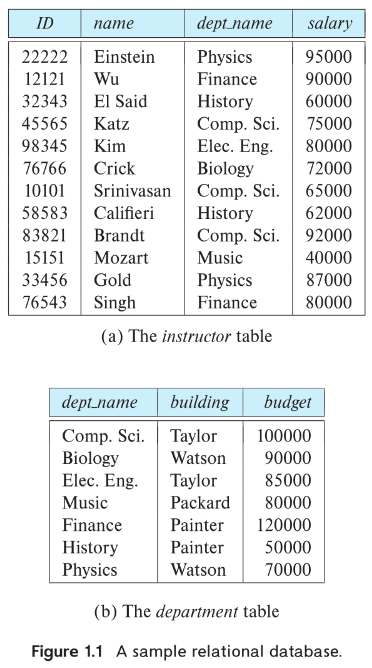
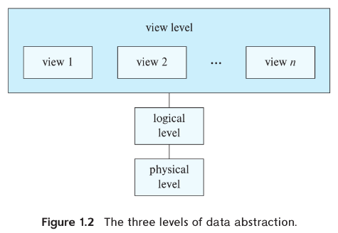
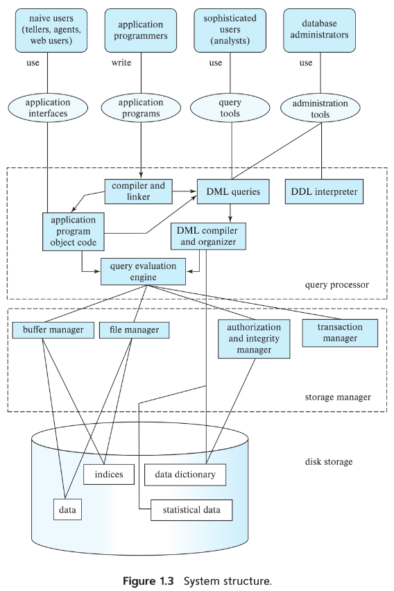
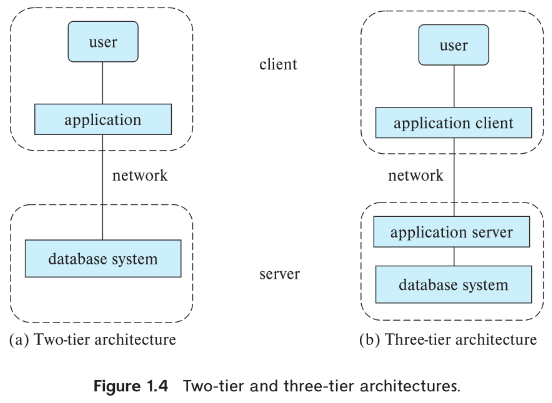

# Capítulo 1: Introducción (Traducción libre del inglés)

**Fuente: Silberschatz, A., Korth, H. F., & Sudarshan, S. (2020). Introduction. In *Database system concepts* (pp. 1-34). McGraw-Hill Education.**

Un *database-management system* (DBMS) o sistema de gestión de bases de datos es una colección de datos interrelacionados y un conjunto de programas para acceder a dichos datos. La colección de datos, usualmente referida como la *database* o base de datos, contiene información relevante para una empresa. El objetivo principal de un DBMS es proporcionar una manera de almacenar y recuperar información de la base de datos que sea tanto conveniente como eficiente.

Los sistemas de bases de datos están diseñados para gestionar grandes volúmenes de información. La gestión de datos implica tanto definir estructuras para el almacenamiento de información como proporcionar mecanismos para la manipulación de dicha información. Además, el sistema de bases de datos debe garantizar la seguridad de la información almacenada, a pesar de fallos del sistema o intentos de acceso no autorizado. Si los datos van a ser compartidos entre varios usuarios, el sistema debe evitar posibles resultados anómalos.

Debido a que la información es tan importante en la mayoría de las organizaciones, los científicos de la computación han desarrollado un amplio cuerpo de conceptos y técnicas para gestionar datos. Estos conceptos y técnicas constituyen el enfoque de este libro. Este capítulo introduce brevemente los principios de los sistemas de bases de datos.

## 1.1 Aplicaciones de los Sistemas de Bases de Datos

Los primeros sistemas de bases de datos surgieron en la década de 1960 como respuesta a la gestión computarizada de datos comerciales. Esas aplicaciones anteriores eran relativamente simples en comparación con las aplicaciones modernas de bases de datos. Las aplicaciones modernas incluyen empresas altamente sofisticadas a nivel mundial.

Todas las aplicaciones de bases de datos, antiguas y nuevas, comparten elementos comunes importantes. El aspecto central de la aplicación no es un programa que realiza algún cálculo, sino más bien los datos mismos. Hoy en día, algunas de las corporaciones más valiosas lo son no debido a sus activos físicos, sino más bien debido a la información que poseen. Imagine un banco sin sus datos sobre cuentas y clientes, o un sitio de red social que pierde las conexiones entre sus usuarios. El valor de tales empresas se perdería casi totalmente bajo tales circunstancias.

Los sistemas de bases de datos se utilizan para gestionar colecciones de datos que:
- son altamente valiosos,
- son relativamente grandes, y
- son accedidos por múltiples usuarios y aplicaciones, frecuentemente al mismo tiempo.

Las primeras aplicaciones de bases de datos tenían únicamente datos simples, precisamente formateados y estructurados. Hoy en día, las aplicaciones de bases de datos pueden incluir datos con relaciones complejas y una estructura más variable. Como ejemplo de una aplicación con datos estructurados, considere los registros de una universidad referentes a cursos, estudiantes e inscripciones a cursos. La universidad mantiene el mismo tipo de información sobre cada curso: *course-identifier* (identificador de curso), *title* (título), *department* (departamento), *course number* (número de curso), etc., y de manera similar para los estudiantes: *student-identifier* (identificador de estudiante), *name* (nombre), *address* (dirección), *phone* (teléfono), etc. La inscripción a cursos es una colección de pares: un identificador de curso y un identificador de estudiante. La información de este tipo tiene una estructura estándar y repetitiva, y es representativa del tipo de aplicaciones de bases de datos que se remontan a la década de 1960. Contraste esta aplicación simple de base de datos universitaria con un sitio de redes sociales. Los usuarios del sitio publican diversos tipos de información sobre sí mismos, que van desde elementos simples como nombre o fecha de nacimiento, hasta publicaciones complejas que consisten en texto, imágenes, videos y enlaces a otros usuarios. Solo existe una cantidad limitada de estructura común entre estos datos. Sin embargo, ambas aplicaciones comparten las características básicas de una base de datos.

Los sistemas modernos de bases de datos aprovechan las similitudes en la estructura de los datos para ganar eficiencia, pero también permiten datos débilmente estructurados y datos cuyos formatos son altamente variables. Como resultado, un sistema de bases de datos es un sistema de software grande y complejo cuya tarea es gestionar una colección grande y compleja de datos.

Gestionar la complejidad es un desafío, no solo en la gestión de datos sino en cualquier dominio. La clave para gestionar la complejidad es el concepto de *abstraction* o abstracción. La abstracción permite a una persona utilizar un dispositivo o sistema complejo sin tener que conocer los detalles de cómo está construido dicho dispositivo o sistema. Una persona es capaz, por ejemplo, de conducir un automóvil sabiendo cómo operar sus controles. Sin embargo, el conductor no necesita saber cómo fue construido el motor ni cómo opera. Todo lo que el conductor necesita saber es una abstracción de lo que hace el motor. De manera similar, para una colección grande y compleja de datos, un sistema de bases de datos proporciona una vista más simple y abstracta de la información, de modo que los usuarios y los programadores de aplicaciones no necesiten estar conscientes de los detalles subyacentes de cómo se almacenan y organizan los datos. Al proporcionar un alto nivel de abstracción, un sistema de bases de datos hace posible que una empresa combine datos de diversos tipos en un repositorio unificado de la información necesaria para operar la empresa.

A continuación se presentan algunas aplicaciones representativas:

**Información Empresarial**
- *Sales* (Ventas): Para información de clientes, productos y compras.
- *Accounting* (Contabilidad): Para pagos, recibos, saldos de cuenta, activos y otra información contable.
- *Human resources* (Recursos humanos): Para información sobre empleados, salarios, impuestos sobre nómina y beneficios, y para la generación de cheques de pago.
- *Manufacturing* (Manufactura): Para la gestión de la cadena de suministro y para el rastreo de la producción de artículos en fábricas, inventarios de artículos en almacenes y tiendas, y pedidos de artículos.

**Banca y Finanzas**
- *Banking* (Banca): Para información de clientes, cuentas, préstamos y transacciones bancarias.
- *Credit card transactions* (Transacciones con tarjetas de crédito): Para compras con tarjetas de crédito y generación de estados de cuenta mensuales.
- *Finance* (Finanzas): Para almacenar información sobre tenencias, ventas y compras de instrumentos financieros como acciones y bonos; también para almacenar datos de mercado en tiempo real para permitir operaciones en línea por parte de clientes y operaciones automatizadas por parte de la empresa.

**Universidades**: Para información de estudiantes, inscripciones a cursos y calificaciones (además de la información empresarial estándar como recursos humanos y contabilidad).

**Aerolíneas**: Para información de reservaciones y horarios. Las aerolíneas fueron de las primeras en utilizar bases de datos de manera geográficamente distribuida.

**Telecomunicaciones**: Para mantener registros de llamadas, mensajes de texto y uso de datos, generar facturas mensuales, mantener saldos en tarjetas telefónicas prepago y almacenar información sobre las redes de comunicación.

**Servicios basados en la web**
- *Social-media* (Redes sociales): Para mantener registros de usuarios, conexiones entre usuarios (como información de amigos/seguidores), publicaciones realizadas por usuarios, información de calificaciones/*like* sobre publicaciones, etc.
- *Online retailers* (Minoristas en línea): Para mantener registros de datos de ventas y pedidos como cualquier minorista, pero también para rastrear las visualizaciones de productos de un usuario, términos de búsqueda, etc., con el propósito de identificar los mejores artículos para recomendar a ese usuario.
- *Online advertisements* (Publicidad en línea): Para mantener registros del historial de clics para permitir anuncios dirigidos, sugerencias de productos, artículos de noticias, etc. Las personas acceden a dichas bases de datos cada vez que realizan una búsqueda web, realizan una compra en línea o acceden a un sitio de redes sociales.
- *Document databases* (Bases de datos documentales): Para mantener colecciones de artículos de noticias, patentes, artículos de investigación publicados, etc.
- *Navigation systems* (Sistemas de navegación): Para mantener las ubicaciones de diversos lugares de interés junto con las rutas exactas de carreteras, sistemas de trenes, autobuses, etc.

Como ilustra esta lista, las bases de datos forman una parte esencial no solo de cada empresa, sino también de una gran parte de las actividades diarias de una persona.

Las formas en que las personas interactúan con las bases de datos han cambiado con el tiempo. Las primeras bases de datos se mantenían como sistemas de *back-office* con los cuales los usuarios interactuaban mediante reportes impresos y formularios en papel para la entrada de datos. A medida que los sistemas de bases de datos se volvieron más sofisticados, se desarrollaron mejores lenguajes para que los programadores los utilizaran al interactuar con los datos, junto con interfaces de usuario que permitían a los usuarios finales dentro de la empresa consultar y actualizar datos.

A medida que mejoró el soporte para la interacción de programadores con bases de datos, y el rendimiento del hardware de computadoras aumentó incluso mientras los costos del hardware disminuían, surgieron aplicaciones más sofisticadas que pusieron los datos de la base de datos en contacto más directo no solo con usuarios finales dentro de una empresa, sino también con el público en general. Mientras que antes los clientes de un banco tenían que interactuar con un cajero para cada transacción, las *automated-teller machines* (ATM) o cajeros automáticos permitieron la interacción directa del cliente. Hoy en día, prácticamente cada empresa emplea aplicaciones web o aplicaciones móviles para permitir que sus clientes interactúen directamente con la base de datos de la empresa y, por lo tanto, con la empresa misma.

El usuario, o cliente, puede enfocarse en el producto o servicio sin estar consciente de los detalles de la gran base de datos que hace posible la interacción. Por ejemplo, cuando lee una publicación en una red social, o accede a una librería en línea y navega por una colección de libros o música, está accediendo a datos almacenados en una base de datos. Cuando ingresa un pedido en línea, su pedido se almacena en una base de datos. Cuando accede al sitio web de un banco y recupera su saldo bancario e información de transacciones, la información se recupera del sistema de bases de datos del banco. Cuando accede a un sitio web, la información sobre usted puede recuperarse de una base de datos para seleccionar qué anuncios debe ver. Casi cada interacción con un teléfono inteligente resulta en algún tipo de acceso a una base de datos. Además, los datos sobre sus accesos web pueden almacenarse en una base de datos.

Por lo tanto, aunque las interfaces de usuario ocultan los detalles del acceso a una base de datos, y la mayoría de las personas ni siquiera son conscientes de que están tratando con una base de datos, acceder a bases de datos forma una parte esencial de la vida de casi todas las personas hoy en día.

En términos generales, existen dos modos en los que se utilizan las bases de datos:

- El primer modo es soportar el *online transaction processing* (OLTP) o procesamiento de transacciones en línea, donde un gran número de usuarios utiliza la base de datos, con cada usuario recuperando cantidades relativamente pequeñas de datos y realizando actualizaciones pequeñas. Este es el modo principal de uso para la gran mayoría de los usuarios de aplicaciones de bases de datos como las que describimos anteriormente.

- El segundo modo es soportar el *data analytics* o análisis de datos, es decir, el procesamiento de datos para extraer conclusiones e inferir reglas o procedimientos de decisión, que luego se utilizan para impulsar decisiones empresariales.

Por ejemplo, los bancos necesitan decidir si otorgar un préstamo a un solicitante; los anunciantes en línea necesitan decidir qué anuncio mostrar a un usuario particular. Estas tareas se abordan en dos pasos. Primero, las técnicas de análisis de datos intentan descubrir automáticamente reglas y patrones a partir de los datos y crear modelos predictivos. Estos modelos toman como entrada atributos ("*features*" o características) de individuos, y producen predicciones como la probabilidad de pagar un préstamo, o de hacer clic en un anuncio, que luego se utilizan para tomar la decisión empresarial.

Como otro ejemplo, los fabricantes y minoristas necesitan tomar decisiones sobre qué artículos fabricar o pedir y en qué cantidades; estas decisiones están impulsadas significativamente por técnicas para analizar datos pasados y predecir tendencias. El costo de tomar decisiones incorrectas puede ser muy alto, y por lo tanto las organizaciones están dispuestas a invertir mucho dinero para recopilar o adquirir los datos requeridos, y construir sistemas que puedan utilizar los datos para hacer predicciones precisas.

El campo del *data mining* o minería de datos combina técnicas de descubrimiento de conocimiento inventadas por investigadores de inteligencia artificial y analistas estadísticos con técnicas de implementación eficiente que permiten su uso en bases de datos extremadamente grandes.

## 1.2 Propósito de los Sistemas de Bases de Datos

Para comprender el propósito de los sistemas de bases de datos, considere parte de una organización universitaria que, entre otros datos, mantiene información sobre todos los instructores, estudiantes, departamentos y ofertas de cursos. Una forma de mantener la información en una computadora es almacenarla en archivos del sistema operativo. Para permitir que los usuarios manipulen la información, el sistema cuenta con varios programas de aplicación que manipulan los archivos, incluyendo programas para:
- Agregar nuevos estudiantes, instructores y cursos.
- Inscribir estudiantes en cursos y generar listas de clase.
- Asignar calificaciones a estudiantes, calcular promedios de calificaciones (*GPA* o *grade point average*) y generar historiales académicos (*transcripts*).

Los programadores desarrollan estos programas de aplicación para satisfacer las necesidades de la universidad.

Se agregan nuevos programas de aplicación al sistema según surge la necesidad. Por ejemplo, suponga que una universidad decide crear una nueva especialidad. Como resultado, la universidad crea un nuevo departamento y crea nuevos archivos permanentes (o agrega información a archivos existentes) para registrar información sobre todos los instructores del departamento, estudiantes de esa especialidad, ofertas de cursos, requisitos de grado, etc. La universidad puede tener que escribir nuevos programas de aplicación para manejar reglas específicas de la nueva especialidad. También pueden tener que escribirse nuevos programas de aplicación para manejar nuevas reglas en la universidad. Así, con el paso del tiempo, el sistema adquiere más archivos y más programas de aplicación.

Este sistema típico de procesamiento de archivos es soportado por un sistema operativo convencional. El sistema almacena registros permanentes en diversos archivos, y necesita diferentes programas de aplicación para extraer registros de, y agregar registros a, los archivos apropiados.

Mantener la información organizacional en un sistema de procesamiento de archivos tiene varias desventajas importantes:

- **Redundancia e inconsistencia de datos**. Dado que diferentes programadores crean los archivos y programas de aplicación durante un período prolongado, es probable que los diversos archivos tengan estructuras diferentes, y los programas pueden estar escritos en varios lenguajes de programación. Además, la misma información puede duplicarse en varios lugares (archivos). Por ejemplo, si un estudiante tiene una doble especialidad (digamos, música y matemáticas), la dirección y número telefónico de ese estudiante pueden aparecer en un archivo que consiste en registros de estudiantes del departamento de Música y en un archivo que consiste en registros de estudiantes del departamento de Matemáticas. Esta redundancia conduce a un mayor costo de almacenamiento y acceso. Además, puede conducir a inconsistencia de datos; es decir, las diversas copias de los mismos datos pueden dejar de coincidir. Por ejemplo, un cambio en la dirección de un estudiante puede reflejarse en los registros del departamento de Música pero no en otras partes del sistema.

- **Dificultad para acceder a los datos**. Suponga que uno de los empleados administrativos de la universidad necesita averiguar los nombres de todos los estudiantes que viven dentro de un área de código postal particular. El empleado solicita al departamento de procesamiento de datos que genere dicha lista. Debido a que los diseñadores del sistema original no anticiparon esta solicitud, no hay un programa de aplicación disponible para atenderla. Sin embargo, existe un programa de aplicación para generar la lista de todos los estudiantes. El empleado administrativo de la universidad tiene ahora dos opciones: obtener la lista de todos los estudiantes y extraer manualmente la información necesaria, o solicitar a un programador que escriba el programa de aplicación necesario. Ambas alternativas son obviamente insatisfactorias. Suponga que se escribe dicho programa y que, varios días después, el mismo empleado necesita reducir esa lista para incluir solo a aquellos estudiantes que han tomado al menos 60 horas crédito. Como era de esperarse, no existe un programa para generar dicha lista. Nuevamente, el empleado tiene las dos opciones anteriores, ninguna de las cuales es satisfactoria. El punto aquí es que los entornos convencionales de procesamiento de archivos no permiten recuperar los datos necesarios de manera conveniente y eficiente. Se requieren sistemas de recuperación de datos más receptivos para uso general.

- **Aislamiento de datos**. Debido a que los datos están dispersos en diversos archivos, y los archivos pueden estar en diferentes formatos, es difícil escribir nuevos programas de aplicación para recuperar los datos apropiados.

- **Problemas de integridad**. Los valores de datos almacenados en la base de datos deben satisfacer ciertos tipos de restricciones de consistencia. Suponga que la universidad mantiene una cuenta para cada departamento, y registra el monto del saldo en cada cuenta. Suponga también que la universidad requiere que el saldo de la cuenta de un departamento nunca pueda caer por debajo de cero. Los desarrolladores hacen cumplir estas restricciones en el sistema agregando código apropiado en los diversos programas de aplicación. Sin embargo, cuando se agregan nuevas restricciones, es difícil cambiar los programas para hacerlas cumplir. El problema se complica cuando las restricciones involucran varios elementos de datos de diferentes archivos.

- **Problemas de atomicidad**. Un sistema de computadoras, como cualquier otro dispositivo, está sujeto a fallos. En muchas aplicaciones, es crucial que, si ocurre un fallo, los datos se restauren al estado consistente que existía antes del fallo. Considere un sistema bancario con un programa para transferir $500 de la cuenta A a la cuenta B. Si ocurre un fallo del sistema durante la ejecución del programa, es posible que los $500 se hayan retirado del saldo de la cuenta A pero no se hayan acreditado al saldo de la cuenta B, resultando en un estado inconsistente de la base de datos. Claramente, es esencial para la consistencia de la base de datos que tanto el crédito como el débito ocurran, o que ninguno ocurra. Es decir, la transferencia de fondos debe ser *atomic* o atómica: debe ocurrir en su totalidad o no ocurrir en absoluto. Es difícil asegurar la atomicidad en un sistema convencional de procesamiento de archivos.

- **Anomalías de acceso concurrente**. Por el bien del rendimiento general del sistema y una respuesta más rápida, muchos sistemas permiten que múltiples usuarios actualicen los datos simultáneamente. De hecho, hoy en día, los minoristas de internet más grandes pueden tener millones de accesos por día a sus datos por parte de compradores. En tal entorno, es posible la interacción de actualizaciones concurrentes y puede resultar en datos inconsistentes. Considere la cuenta A, con un saldo de $10,000. Si dos empleados bancarios debitan el saldo de la cuenta A (digamos $500 y $100, respectivamente) casi exactamente al mismo tiempo, el resultado de las ejecuciones concurrentes puede dejar el saldo de la cuenta A en un estado incorrecto (o inconsistente). Suponga que los programas que se ejecutan en nombre de cada retiro leen el saldo antiguo, reducen ese valor por la cantidad que se retira, y escriben el resultado. Si los dos programas se ejecutan concurrentemente, ambos pueden leer el valor $10,000, y escribir de regreso $9,500 y $9,900, respectivamente. Dependiendo de cuál escriba el valor último, el saldo de la cuenta A puede contener ya sea $9,500 o $9,900, en lugar del valor correcto de $9,400. Para protegerse contra esta posibilidad, el sistema debe mantener alguna forma de supervisión. Pero la supervisión es difícil de proporcionar porque los datos pueden ser accedidos por muchos programas de aplicación diferentes que no han sido coordinados previamente.

Como otro ejemplo, suponga que un programa de inscripción mantiene un conteo de estudiantes inscritos en un curso para hacer cumplir límites en el número de estudiantes inscritos. Cuando un estudiante se inscribe, el programa lee el conteo actual para el curso, verifica que el conteo no esté ya en el límite, agrega uno al conteo, y almacena el conteo de regreso en la base de datos. Suponga que dos estudiantes se inscriben concurrentemente, con el conteo en 39. Las dos ejecuciones del programa pueden leer ambas el valor 39, y ambas escribirían de regreso 40, conduciendo a un incremento incorrecto de solo 1, aunque dos estudiantes se inscribieron exitosamente en el curso y el conteo debería ser 41. Además, suponga que el límite de inscripción al curso era 40; en el caso anterior, ambos estudiantes podrían inscribirse, conduciendo a una violación del límite de 40 estudiantes.

- **Problemas de seguridad**. No cada usuario del sistema de bases de datos debería poder acceder a todos los datos. Por ejemplo, en una universidad, el personal de nómina necesita ver solo aquella parte de la base de datos que tiene información financiera. No necesitan acceso a información sobre registros académicos. Pero dado que los programas de aplicación se agregan al sistema de procesamiento de archivos de manera *ad hoc*, hacer cumplir tales restricciones de seguridad es difícil.

Estas dificultades, entre otras, impulsaron tanto el desarrollo inicial de sistemas de bases de datos como la transición de aplicaciones basadas en archivos a sistemas de bases de datos, en las décadas de 1960 y 1970.

En lo que sigue, veremos los conceptos y algoritmos que permiten a los sistemas de bases de datos resolver los problemas de los sistemas de procesamiento de archivos. En la mayor parte de este libro, utilizamos una organización universitaria como ejemplo recurrente de una aplicación típica de procesamiento de datos.

## 1.3 Vista de los Datos

Un sistema de bases de datos es una colección de datos interrelacionados y un conjunto de programas que permiten a los usuarios acceder y modificar estos datos. Un propósito principal de un sistema de bases de datos es proporcionar a los usuarios una vista abstracta de los datos. Es decir, el sistema oculta ciertos detalles de cómo se almacenan y mantienen los datos.

### 1.3.1 Modelos de Datos

Subyacente a la estructura de una base de datos está el *data model* o modelo de datos: una colección de herramientas conceptuales para describir datos, relaciones entre datos, semántica de datos y restricciones de consistencia.

Existen varios modelos de datos diferentes que cubriremos en el texto. Los modelos de datos pueden clasificarse en cuatro categorías diferentes:

- **Modelo Relacional**. El modelo relacional utiliza una colección de tablas para representar tanto los datos como las relaciones entre esos datos. Cada tabla tiene múltiples columnas, y cada columna tiene un nombre único. Las tablas también se conocen como *relations* o relaciones. El modelo relacional es un ejemplo de un modelo basado en registros. Los modelos basados en registros se denominan así porque la base de datos está estructurada en registros de formato fijo de varios tipos. Cada tabla contiene registros de un tipo particular. Cada tipo de registro define un número fijo de campos, o atributos. Las columnas de la tabla corresponden a los atributos del tipo de registro. El modelo de datos relacional es el modelo de datos más ampliamente utilizado, y una gran mayoría de los sistemas de bases de datos actuales se basan en el modelo relacional. El Capítulo 2 y el Capítulo 7 cubren el modelo relacional en detalle.

- **Modelo Entidad-Relación**. El modelo de datos *entity-relationship* (E-R) o entidad-relación utiliza una colección de objetos básicos, llamados *entities* o entidades, y relaciones entre estos objetos. Una entidad es una "cosa" u "objeto" en el mundo real que es distinguible de otros objetos. El modelo entidad-relación es ampliamente utilizado en el diseño de bases de datos. El Capítulo 6 lo explora en detalle.

- **Modelo de Datos Semiestructurados**. El modelo de datos semiestructurado permite la especificación de datos donde los elementos de datos individuales del mismo tipo pueden tener diferentes conjuntos de atributos. Esto contrasta con los modelos de datos mencionados anteriormente, donde cada elemento de datos de un tipo particular debe tener el mismo conjunto de atributos. JSON y *Extensible Markup Language* (XML) o Lenguaje de Marcado Extensible son representaciones de datos semiestructurados ampliamente utilizadas. Los modelos de datos semiestructurados se exploran en detalle en el Capítulo 8.

- **Modelo de Datos Basado en Objetos**. La programación orientada a objetos (especialmente en Java, C++ o C#) se ha convertido en la metodología dominante de desarrollo de software. Esto condujo inicialmente al desarrollo de un modelo de datos orientado a objetos distinto, pero hoy en día el concepto de objetos está bien integrado en las bases de datos relacionales. Existen estándares para almacenar objetos en tablas relacionales. Los sistemas de bases de datos permiten que los procedimientos se almacenen en el sistema de bases de datos y sean ejecutados por el sistema de bases de datos. Esto puede verse como una extensión del modelo relacional con nociones de encapsulamiento, métodos e identidad de objetos. Los modelos de datos basados en objetos se resumen en el Capítulo 8.

Una gran parte de este texto se enfoca en el modelo relacional porque sirve como fundamento para la mayoría de las aplicaciones de bases de datos.

### 1.3.2 Modelo de Datos Relacional

En el modelo relacional, los datos se representan en forma de tablas. Cada tabla tiene múltiples columnas, y cada columna tiene un nombre único. Cada fila de la tabla representa una pieza de información. 



La Figura 1.1 presenta una base de datos relacional de ejemplo que comprende dos tablas: una muestra detalles de instructores universitarios y la otra muestra detalles de los diversos departamentos universitarios.

La primera tabla, la tabla *instructor*, muestra, por ejemplo, que un instructor llamado Einstein con ID 22222 es miembro del departamento de Física y tiene un salario anual de $95,000. La segunda tabla, *department*, muestra, por ejemplo, que el departamento de Biología está ubicado en el edificio Watson y tiene un presupuesto de $90,000. Por supuesto, una universidad del mundo real tendría muchos más departamentos e instructores. Utilizamos tablas pequeñas en el texto para ilustrar conceptos. Un ejemplo más grande para el mismo esquema está disponible en línea.

### 1.3.3 Abstracción de Datos

Para que el sistema sea utilizable, debe recuperar datos eficientemente. La necesidad de eficiencia ha llevado a los desarrolladores de sistemas de bases de datos a utilizar estructuras de datos complejas para representar datos en la base de datos. Dado que muchos usuarios de sistemas de bases de datos no están entrenados en computación, los desarrolladores ocultan la complejidad a los usuarios mediante varios niveles de abstracción de datos, para simplificar las interacciones de los usuarios con el sistema:

- **Nivel físico**. El nivel más bajo de abstracción describe cómo se almacenan realmente los datos. El nivel físico describe estructuras de datos complejas de bajo nivel en detalle.

- **Nivel lógico**. El siguiente nivel más alto de abstracción describe qué datos se almacenan en la base de datos, y qué relaciones existen entre esos datos. El nivel lógico describe así toda la base de datos en términos de un pequeño número de estructuras relativamente simples. Aunque la implementación de las estructuras simples en el nivel lógico puede involucrar estructuras complejas en el nivel físico, el usuario del nivel lógico no necesita estar consciente de esta complejidad. Esto se conoce como *physical data independence* o independencia de datos física. Los administradores de bases de datos, quienes deben decidir qué información mantener en la base de datos, utilizan el nivel lógico de abstracción.

- **Nivel de vista**. El nivel más alto de abstracción describe solo una parte de toda la base de datos. Aunque el nivel lógico utiliza estructuras más simples, la complejidad permanece debido a la variedad de información almacenada en una base de datos grande. Muchos usuarios del sistema de bases de datos no necesitan toda esta información; en cambio, necesitan acceder solo a una parte de la base de datos. El nivel de vista de abstracción existe para simplificar su interacción con el sistema. El sistema puede proporcionar muchas vistas para la misma base de datos.



Una característica importante de los modelos de datos, como el modelo relacional, es que ocultan tales detalles de implementación de bajo nivel no solo a los usuarios de bases de datos, sino incluso a los desarrolladores de aplicaciones de bases de datos. El sistema de bases de datos permite a los desarrolladores de aplicaciones almacenar y recuperar datos utilizando las abstracciones del modelo de datos, y convierte las operaciones abstractas en operaciones sobre la implementación de bajo nivel.

Una analogía con el concepto de tipos de datos en lenguajes de programación puede aclarar la distinción entre niveles de abstracción. Muchos lenguajes de programación de alto nivel soportan la noción de un tipo estructurado. Podemos describir el tipo de un registro abstractamente de la siguiente manera:

```
type instructor = record
    ID: char(5);
    name: char(20);
    dept_name: char(20);
    salary: numeric(8,2);
end;
```

Este código define un nuevo tipo de registro llamado *instructor* con cuatro campos. Cada campo tiene un nombre y un tipo asociado. Por ejemplo, *char(20)* especifica una cadena con 20 caracteres, mientras que *numeric(8,2)* especifica un número con 8 dígitos, dos de los cuales están a la derecha del punto decimal. Una organización universitaria puede tener varios tipos de registro tales, incluyendo:
- *department*, con campos *dept_name*, *building* y *budget*.
- *course*, con campos *course_id*, *title*, *dept_name* y *credits*.
- *student*, con campos *ID*, *name*, *dept_name* y *tot_cred*.

En el nivel físico, un registro de instructor, departamento o estudiante puede describirse como un bloque de bytes consecutivos. El compilador oculta este nivel de detalle a los programadores. De manera similar, el sistema de bases de datos oculta muchos de los detalles de almacenamiento de nivel más bajo a los programadores de bases de datos. Los administradores de bases de datos, por otro lado, pueden estar conscientes de ciertos detalles de la organización física de los datos. Por ejemplo, existen muchas formas posibles de almacenar tablas en archivos. Una forma es almacenar una tabla como una secuencia de registros en un archivo, con un carácter especial (como una coma) utilizado para delimitar los diferentes atributos de un registro, y otro carácter especial (como un carácter de nueva línea) puede utilizarse para delimitar registros. Si todos los atributos tienen longitud fija, las longitudes de los atributos pueden almacenarse por separado, y los delimitadores pueden omitirse del archivo. Los atributos de longitud variable podrían manejarse almacenando la longitud, seguida de los datos. Las bases de datos utilizan un tipo de estructura de datos llamado *index* o índice para soportar la recuperación eficiente de registros; estos también forman parte del nivel físico.

En el nivel lógico, cada registro tal se describe mediante una definición de tipo, como en el segmento de código anterior. La interrelación de estos tipos de registro también se define en el nivel lógico; un requisito de que el valor de *dept_name* de un registro de instructor debe aparecer en la tabla *department* es un ejemplo de tal interrelación. Los programadores que utilizan un lenguaje de programación trabajan en este nivel de abstracción. De manera similar, los administradores de bases de datos usualmente trabajan en este nivel de abstracción.

Finalmente, en el nivel de vista, los usuarios de computadoras ven un conjunto de programas de aplicación que ocultan detalles de los tipos de datos. En el nivel de vista, se definen varias vistas de la base de datos, y un usuario de base de datos ve algunas o todas estas vistas. Además de ocultar detalles del nivel lógico de la base de datos, las vistas también proporcionan un mecanismo de seguridad para prevenir que los usuarios accedan a ciertas partes de la base de datos. Por ejemplo, los empleados administrativos en la oficina del registrador universitario pueden ver solo aquella parte de la base de datos que tiene información sobre estudiantes; no pueden acceder a información sobre salarios de instructores.

### 1.3.4 Instancias y Esquemas

Las bases de datos cambian con el tiempo a medida que se inserta y elimina información. La colección de información almacenada en la base de datos en un momento particular se llama una *instance* o instancia de la base de datos. El diseño general de la base de datos se llama el *database schema* o esquema de la base de datos. El concepto de esquemas e instancias de bases de datos puede entenderse por analogía con un programa escrito en un lenguaje de programación. Un esquema de base de datos corresponde a las declaraciones de variables (junto con las definiciones de tipo asociadas) en un programa. Cada variable tiene un valor particular en un instante dado. Los valores de las variables en un programa en un punto en el tiempo corresponden a una instancia de un esquema de base de datos.

Los sistemas de bases de datos tienen varios esquemas, particionados de acuerdo con los niveles de abstracción. El esquema físico describe el diseño de la base de datos en el nivel físico, mientras que el esquema lógico describe el diseño de la base de datos en el nivel lógico. Una base de datos también puede tener varios esquemas en el nivel de vista, a veces llamados *subschemas*, que describen diferentes vistas de la base de datos.

De estos, el esquema lógico es con mucho el más importante en términos de su efecto en los programas de aplicación, ya que los programadores construyen aplicaciones utilizando el esquema lógico. El esquema físico está oculto debajo del esquema lógico y usualmente puede cambiarse fácilmente sin afectar los programas de aplicación. Se dice que los programas de aplicación exhiben independencia de datos física si no dependen del esquema físico y por lo tanto no necesitan reescribirse si el esquema físico cambia.

También notamos que es posible crear esquemas que tienen problemas, como información duplicada innecesariamente. Por ejemplo, suponga que almacenamos el presupuesto del departamento como un atributo del registro de instructor. Entonces, cada vez que el valor del presupuesto para un departamento (digamos el departamento de Física) cambie, ese cambio debe reflejarse en los registros de todos los instructores asociados con el departamento. En el Capítulo 7, estudiaremos cómo distinguir buenos diseños de esquemas de malos diseños de esquemas.

Tradicionalmente, los esquemas lógicos se cambiaban infrecuentemente, si es que se cambiaban. Sin embargo, muchas aplicaciones modernas de bases de datos requieren esquemas lógicos más flexibles donde, por ejemplo, diferentes registros en una sola relación pueden tener diferentes atributos.

## 1.4 Lenguajes de Bases de Datos

Un sistema de bases de datos proporciona un *data-definition language* (DDL) o lenguaje de definición de datos para especificar el esquema de la base de datos y un *data-manipulation language* (DML) o lenguaje de manipulación de datos para expresar consultas y actualizaciones de bases de datos. En la práctica, los lenguajes de definición y manipulación de datos no son dos lenguajes separados; en cambio, simplemente forman partes de un solo lenguaje de bases de datos, como el lenguaje SQL. Casi todos los sistemas de bases de datos relacionales emplean el lenguaje SQL, que cubrimos en gran detalle en el Capítulo 3, Capítulo 4 y Capítulo 5.

### 1.4.1 Lenguaje de Definición de Datos

Especificamos un esquema de base de datos mediante un conjunto de definiciones expresadas por un lenguaje especial llamado lenguaje de definición de datos (DDL). El DDL también se utiliza para especificar propiedades adicionales de los datos.

Especificamos la estructura de almacenamiento y los métodos de acceso utilizados por el sistema de bases de datos mediante un conjunto de sentencias en un tipo especial de DDL llamado lenguaje de definición y almacenamiento de datos. Estas sentencias definen los detalles de implementación de los esquemas de bases de datos, que usualmente están ocultos a los usuarios.

Los valores de datos almacenados en la base de datos deben satisfacer ciertas restricciones de consistencia. Por ejemplo, suponga que la universidad requiere que el saldo de la cuenta de un departamento nunca pueda ser negativo. El DDL proporciona facilidades para especificar tales restricciones. El sistema de bases de datos verifica estas restricciones cada vez que se actualiza la base de datos. En general, una restricción puede ser un predicado arbitrario perteneciente a la base de datos. Sin embargo, los predicados arbitrarios pueden ser costosos de probar. Por lo tanto, los sistemas de bases de datos implementan solo aquellas restricciones de integridad que pueden probarse con sobrecarga mínima:

- **Restricciones de Dominio**. Debe asociarse un dominio de valores posibles con cada atributo (por ejemplo, tipos enteros, tipos de carácter, tipos de fecha/hora). Declarar que un atributo es de un dominio particular actúa como una restricción sobre los valores que puede tomar. Las restricciones de dominio son la forma más elemental de restricción de integridad. Son probadas fácilmente por el sistema cada vez que se ingresa un nuevo elemento de datos en la base de datos.

- **Integridad Referencial**. Existen casos en los que deseamos asegurar que un valor que aparece en una relación para un conjunto dado de atributos también aparezca en un cierto conjunto de atributos en otra relación (integridad referencial). Por ejemplo, el departamento listado para cada curso debe ser uno que realmente exista en la universidad. Más precisamente, el valor de *dept_name* en un registro de curso debe aparecer en el atributo *dept_name* de algún registro de la relación *department*. Las modificaciones a la base de datos pueden causar violaciones de la integridad referencial. Cuando se viola una restricción de integridad referencial, el procedimiento normal es rechazar la acción que causó la violación.

- **Autorización**. Podemos querer diferenciar entre los usuarios en cuanto al tipo de acceso que se les permite sobre diversos valores de datos en la base de datos. Estas diferenciaciones se expresan en términos de autorización, siendo las más comunes: autorización de lectura (*read authorization*), que permite leer, pero no modificar, datos; autorización de inserción (*insert authorization*), que permite la inserción de nuevos datos, pero no la modificación de datos existentes; autorización de actualización (*update authorization*), que permite la modificación, pero no la eliminación, de datos; y autorización de eliminación (*delete authorization*), que permite la eliminación de datos. Podemos asignar al usuario todas, ninguna, o una combinación de estos tipos de autorización.

El procesamiento de sentencias DDL, al igual que el de cualquier otro lenguaje de programación, genera alguna salida. La salida del DDL se coloca en el *data dictionary* o diccionario de datos, que contiene *metadata* o metadatos, es decir, datos sobre datos. El diccionario de datos se considera un tipo especial de tabla que puede ser accedida y actualizada solo por el propio sistema de bases de datos (no por un usuario regular). El sistema de bases de datos consulta el diccionario de datos antes de leer o modificar datos reales.

### 1.4.2 El Lenguaje de Definición de Datos de SQL

SQL proporciona un DDL rico que permite definir tablas con tipos de datos y restricciones de integridad.

Por ejemplo, la siguiente sentencia DDL de SQL define la tabla *department*:

```sql
create table department (
    dept_name varchar(20),
    building varchar(15),
    budget numeric(12,2),
    primary key(dept_name)
);
```

La ejecución de la sentencia DDL anterior crea la tabla *department* con tres columnas: *dept_name*, *building* y *budget*, cada una de las cuales tiene un tipo de dato específico asociado. Discutimos los tipos de datos con más detalle en el Capítulo 3.

El DDL de SQL también soporta varios tipos de restricciones de integridad. Por ejemplo, se puede especificar que el valor del atributo *dept_name* es una *primary key* o clave primaria, asegurando que no haya dos departamentos que puedan tener el mismo nombre de departamento. Como otro ejemplo, se puede especificar que el valor del atributo *dept_name* que aparece en cualquier registro de instructor también debe aparecer en el atributo *dept_name* de algún registro de la tabla *department*. Discutimos el soporte de SQL para restricciones de integridad y autorizaciones en el Capítulo 3 y Capítulo 4.

### 1.4.3 Lenguaje de Manipulación de Datos

Un lenguaje de manipulación de datos (DML) es un lenguaje que permite a los usuarios acceder o manipular datos tal como están organizados por el modelo de datos apropiado. Los tipos de acceso son:
- Recuperación de información almacenada en la base de datos.
- Inserción de nueva información en la base de datos.
- Eliminación de información de la base de datos.
- Modificación de información almacenada en la base de datos.

Existen básicamente dos tipos de lenguaje de manipulación de datos:
- Los DML procedimentales requieren que un usuario especifique qué datos se necesitan y cómo obtener esos datos.
- Los DML declarativos (también referidos como DML no procedimentales) requieren que un usuario especifique qué datos se necesitan sin especificar cómo obtener esos datos.

Los DML declarativos son usualmente más fáciles de aprender y usar que los DML procedimentales. Sin embargo, dado que un usuario no tiene que especificar cómo obtener los datos, el sistema de bases de datos tiene que determinar un medio eficiente de acceder a los datos.

Una *query* o consulta es una sentencia que solicita la recuperación de información. La porción de un DML que involucra la recuperación de información se llama lenguaje de consultas. Aunque técnicamente incorrecto, es práctica común utilizar los términos lenguaje de consultas y lenguaje de manipulación de datos como sinónimos.

Existen varios lenguajes de consultas de bases de datos en uso, ya sea comercialmente o experimentalmente. Estudiamos el lenguaje de consultas más ampliamente utilizado, SQL, en el Capítulo 3 al Capítulo 5.

Los niveles de abstracción que discutimos en la Sección 1.3 aplican no solo a la definición o estructuración de datos, sino también a la manipulación de datos. En el nivel físico, debemos definir algoritmos que permitan el acceso eficiente a los datos. En niveles más altos de abstracción, enfatizamos la facilidad de uso. El objetivo es permitir que los humanos interactúen eficientemente con el sistema. El componente *query processor* o procesador de consultas del sistema de bases de datos (que estudiamos en el Capítulo 15 y Capítulo 16) traduce las consultas DML en secuencias de acciones en el nivel físico del sistema de bases de datos. En el Capítulo 22, estudiamos el procesamiento de consultas en los entornos cada vez más comunes de procesamiento paralelo y distribuido.

### 1.4.4 El Lenguaje de Manipulación de Datos de SQL

El lenguaje de consultas de SQL es no procedimental. Una consulta toma como entrada varias tablas (posiblemente solo una) y siempre devuelve una sola tabla. Aquí hay un ejemplo de una consulta SQL que encuentra los nombres de todos los instructores en el departamento de Historia:

```sql
select instructor.name
from instructor
where instructor.dept_name = 'History';
```

La consulta especifica que deben recuperarse aquellas filas de la tabla *instructor* donde el *dept_name* es Historia, y debe mostrarse el atributo *name* de estas filas. El resultado de ejecutar esta consulta es una tabla con una sola columna etiquetada *name* y un conjunto de filas, cada una de las cuales contiene el nombre de un instructor cuyo *dept_name* es Historia. Si la consulta se ejecuta sobre la tabla en la Figura 1.1, el resultado consiste en dos filas, una con el nombre El Said y la otra con el nombre Califieri.

Las consultas pueden involucrar información de más de una tabla. Por ejemplo, la siguiente consulta encuentra el ID de instructor y nombre de departamento de todos los instructores asociados con un departamento con un presupuesto de más de $95,000:

```sql
select instructor.ID, department.dept_name
from instructor, department
where instructor.dept_name = department.dept_name
  and department.budget > 95000;
```

Si la consulta anterior se ejecutara sobre las tablas en la Figura 1.1, el sistema encontraría que hay dos departamentos con un presupuesto mayor a $95,000—Ciencias de la Computación y Finanzas; hay cinco instructores en estos departamentos. Por lo tanto, el resultado consiste en una tabla con dos columnas (ID, dept_name) y cinco filas: (12121, Finance), (45565, Computer Science), (10101, Computer Science), (83821, Computer Science), y (76543, Finance).

### 1.4.5 Acceso a Bases de Datos desde Programas de Aplicación

Los lenguajes de consultas no procedimentales como SQL no son tan poderosos como una máquina de Turing universal; es decir, existen algunos cómputos que son posibles utilizando un lenguaje de programación de propósito general pero que no son posibles utilizando SQL. SQL tampoco soporta acciones como entrada de usuarios, salida a pantallas, o comunicación a través de la red. Tales cómputos y acciones deben escribirse en un lenguaje anfitrión (*host language*), como C/C++, Java o Python, con consultas SQL embebidas que acceden a los datos en la base de datos.

Los programas de aplicación son programas que se utilizan para interactuar con la base de datos de esta manera. Ejemplos en un sistema universitario son programas que permiten a los estudiantes inscribirse en cursos, generar listas de clase, calcular el GPA de estudiantes, generar cheques de nómina, y realizar otras tareas.

Para acceder a la base de datos, las sentencias DML necesitan enviarse desde el anfitrión a la base de datos donde serán ejecutadas. Esto se hace más comúnmente utilizando una *application-program interface* (API) o interfaz de programación de aplicaciones (conjunto de procedimientos) que puede utilizarse para enviar sentencias DML y DDL a la base de datos y recuperar los resultados. El estándar *Open Database Connectivity* (ODBC) define interfaces de programación de aplicaciones para uso con C y varios otros lenguajes. El estándar *Java Database Connectivity* (JDBC) define una interfaz correspondiente para el lenguaje Java.

## 1.5 Diseño de Bases de Datos

Los sistemas de bases de datos están diseñados para gestionar grandes volúmenes de información. Estos grandes volúmenes de información no existen de forma aislada. Son parte de la operación de alguna empresa cuyo producto final puede ser información de la base de datos o puede ser algún dispositivo o servicio para el cual la base de datos juega solo un papel de soporte.

El diseño de bases de datos implica principalmente el diseño del esquema de la base de datos. El diseño de un entorno completo de aplicación de base de datos que satisfaga las necesidades de la empresa que se está modelando requiere atención a un conjunto más amplio de cuestiones. En este texto, nos enfocamos en la escritura de consultas de bases de datos y el diseño de esquemas de bases de datos, pero discutimos el diseño de aplicaciones más adelante, en el Capítulo 9.

Un modelo de datos de alto nivel proporciona al diseñador de bases de datos un marco conceptual en el cual especificar los requisitos de datos de los usuarios de la base de datos y cómo se estructurará la base de datos para cumplir con estos requisitos. La fase inicial del diseño de bases de datos, entonces, es caracterizar completamente las necesidades de datos de los usuarios prospectivos de la base de datos. El diseñador de bases de datos necesita interactuar extensivamente con expertos en el dominio y usuarios para llevar a cabo esta tarea. El resultado de esta fase es una especificación de requisitos de usuario.

A continuación, el diseñador elige un modelo de datos, y aplicando los conceptos del modelo de datos elegido, traduce estos requisitos en un esquema conceptual de la base de datos. El esquema desarrollado en esta fase de diseño conceptual proporciona una visión general detallada de la empresa. El diseñador revisa el esquema para confirmar que todos los requisitos de datos están efectivamente satisfechos y no están en conflicto entre sí. El diseñador también puede examinar el diseño para eliminar cualquier característica redundante. El enfoque en este punto está en describir los datos y sus relaciones, más que en especificar detalles de almacenamiento físico.

En términos del modelo relacional, el proceso de diseño conceptual implica decisiones sobre qué atributos queremos capturar en la base de datos y cómo agrupar estos atributos para formar las diversas tablas. La parte del "qué" es básicamente una decisión empresarial, y no la discutiremos más en este texto. La parte del "cómo" es principalmente un problema de ciencias de la computación. Existen principalmente dos formas de abordar el problema. La primera es utilizar el modelo entidad-relación (Capítulo 6); la otra es emplear un conjunto de algoritmos (conocidos colectivamente como *normalization* o normalización) que toma como entrada el conjunto de todos los atributos y genera un conjunto de tablas (Capítulo 7).

Un esquema conceptual completamente desarrollado indica los requisitos funcionales de la empresa. En una especificación de requisitos funcionales, los usuarios describen los tipos de operaciones (o transacciones) que se realizarán sobre los datos. Ejemplos de operaciones incluyen modificar o actualizar datos, buscar y recuperar datos específicos, y eliminar datos. En esta etapa del diseño conceptual, el diseñador puede revisar el esquema para asegurar que cumple con los requisitos funcionales.

El proceso de mover de un modelo de datos abstracto a la implementación de la base de datos procede en dos fases finales de diseño. En la fase de diseño lógico, el diseñador mapea el esquema conceptual de alto nivel sobre el modelo de datos de implementación del sistema de bases de datos que se utilizará. El diseñador utiliza el esquema de base de datos resultante específico del sistema en la fase subsiguiente de diseño físico, en la cual se especifican las características físicas de la base de datos. Estas características incluyen la forma de organización de archivos y las estructuras de almacenamiento internas; se discuten en el Capítulo 13.

## 1.6 Motor de Base de Datos

Un sistema de bases de datos está particionado en módulos que se encargan de cada una de las responsabilidades del sistema general. Los componentes funcionales de un sistema de bases de datos pueden dividirse ampliamente en el gestor de almacenamiento, los componentes del procesador de consultas, y el componente de gestión de transacciones.

El gestor de almacenamiento es importante porque las bases de datos típicamente requieren una gran cantidad de espacio de almacenamiento. Las bases de datos corporativas comúnmente varían en tamaño desde cientos de gigabytes hasta terabytes de datos. Un gigabyte es aproximadamente 1 mil millones de bytes, o 1000 megabytes (más precisamente, 1024 megabytes), mientras que un terabyte es aproximadamente 1 billón de bytes o 1 millón de megabytes (más precisamente, 1024 gigabytes). Las empresas más grandes tienen bases de datos que alcanzan el rango de múltiples petabytes (un petabyte es 1024 terabytes). Dado que la memoria principal de las computadoras no puede almacenar tanta información, y dado que los contenidos de la memoria principal se pierden en un fallo del sistema, la información se almacena en discos. Los datos se mueven entre el almacenamiento en disco y la memoria principal según sea necesario. Dado que el movimiento de datos hacia y desde el disco es lento en relación con la velocidad de la unidad central de procesamiento (CPU), es imperativo que el sistema de bases de datos estructure los datos de manera que minimice la necesidad de mover datos entre disco y memoria principal. Cada vez más, se utilizan *solid-state disks* (SSD) o unidades de estado sólido para el almacenamiento de bases de datos. Los SSD son más rápidos que los discos tradicionales pero también más costosos.

El procesador de consultas es importante porque ayuda al sistema de bases de datos a simplificar y facilitar el acceso a los datos. El procesador de consultas permite a los usuarios de bases de datos obtener buen rendimiento mientras pueden trabajar en el nivel de vista y no estar cargados con la comprensión de los detalles de nivel físico de la implementación del sistema. Es trabajo del sistema de bases de datos traducir actualizaciones y consultas escritas en un lenguaje no procedimental, en el nivel lógico, en una secuencia eficiente de operaciones en el nivel físico.

El gestor de transacciones es importante porque permite a los desarrolladores de aplicaciones tratar una secuencia de accesos a la base de datos como si fueran una sola unidad que ocurre en su totalidad o no ocurre en absoluto. Esto permite a los desarrolladores de aplicaciones pensar en un nivel más alto de abstracción sobre la aplicación sin necesidad de preocuparse por los detalles de nivel más bajo de gestionar los efectos del acceso concurrente a los datos y de fallos del sistema.

Mientras que los motores de bases de datos eran tradicionalmente sistemas de computadoras centralizados, hoy el procesamiento paralelo es clave para manejar cantidades muy grandes de datos eficientemente. Los motores modernos de bases de datos prestan mucha atención al almacenamiento paralelo de datos y al procesamiento paralelo de consultas.

### 1.6.1 Gestor de Almacenamiento

El gestor de almacenamiento es el componente de un sistema de bases de datos que proporciona la interfaz entre los datos de bajo nivel almacenados en la base de datos y los programas de aplicación y consultas enviadas al sistema. El gestor de almacenamiento es responsable de la interacción con el gestor de archivos. Los datos crudos se almacenan en el disco utilizando el sistema de archivos proporcionado por el sistema operativo. El gestor de almacenamiento traduce las diversas sentencias DML en comandos de sistema de archivos de bajo nivel. Por lo tanto, el gestor de almacenamiento es responsable de almacenar, recuperar y actualizar datos en la base de datos.

Los componentes del gestor de almacenamiento incluyen:
- **Gestor de autorización e integridad**, que prueba la satisfacción de restricciones de integridad y verifica la autoridad de los usuarios para acceder a datos.
- **Gestor de transacciones**, que asegura que la base de datos permanezca en un estado consistente (correcto) a pesar de fallos del sistema, y que las ejecuciones de transacciones concurrentes procedan sin conflictos.
- **Gestor de archivos**, que gestiona la asignación de espacio en almacenamiento en disco y las estructuras de datos utilizadas para representar información almacenada en disco.
- **Gestor de búfer**, que es responsable de recuperar datos del almacenamiento en disco hacia la memoria principal, y decidir qué datos almacenar en caché en la memoria principal. El gestor de búfer es una parte crítica del sistema de bases de datos, ya que permite a la base de datos manejar tamaños de datos que son mucho mayores que el tamaño de la memoria principal.

El gestor de almacenamiento implementa varias estructuras de datos como parte de la implementación del sistema físico:
- **Archivos de datos**, que almacenan la base de datos misma.
- **Diccionario de datos**, que almacena metadatos sobre la estructura de la base de datos, en particular el esquema de la base de datos.
- **Índices**, que pueden proporcionar acceso rápido a elementos de datos. Al igual que el índice en este libro de texto, un índice de base de datos proporciona punteros a aquellos elementos de datos que contienen un valor particular. Por ejemplo, podríamos utilizar un índice para encontrar el registro de instructor con un ID particular, o todos los registros de instructor con un nombre particular.

Discutimos medios de almacenamiento, estructuras de archivos y gestión de búfer en el Capítulo 12 y Capítulo 13. Los métodos para acceder a datos eficientemente se discuten en el Capítulo 14.

### 1.6.2 El Procesador de Consultas

Los componentes del procesador de consultas incluyen:
- **Intérprete DDL**, que interpreta sentencias DDL y registra las definiciones en el diccionario de datos.
- **Compilador DML**, que traduce sentencias DML en un lenguaje de consultas en un plan de evaluación que consiste en instrucciones de bajo nivel que el motor de evaluación de consultas entiende. Una consulta usualmente puede traducirse a cualquiera de varios planes de evaluación alternativos que todos dan el mismo resultado. El compilador DML también realiza *query optimization* u optimización de consultas; es decir, selecciona el plan de evaluación de menor costo entre las alternativas.
- **Motor de evaluación de consultas**, que ejecuta las instrucciones de bajo nivel generadas por el compilador DML.

La evaluación de consultas se cubre en el Capítulo 15, mientras que los métodos mediante los cuales el optimizador de consultas elige entre las posibles estrategias de evaluación se discuten en el Capítulo 16.

### 1.6.3 Gestión de Transacciones

Frecuentemente, varias operaciones sobre la base de datos forman una sola unidad lógica de trabajo. Un ejemplo es una transferencia de fondos, como en la Sección 1.2, en la cual una cuenta A se debita y otra cuenta B se acredita. Claramente, es esencial que tanto el crédito como el débito ocurran, o que ninguno ocurra. Es decir, la transferencia de fondos debe ocurrir en su totalidad o no ocurrir en absoluto. Este requisito de todo-o-nada se llama *atomicity* o atomicidad. Además, es esencial que la ejecución de la transferencia de fondos preserve la consistencia de la base de datos. Es decir, el valor de la suma de los saldos de A y B debe preservarse. Este requisito de corrección se llama *consistency* o consistencia. Finalmente, después de la ejecución exitosa de una transferencia de fondos, los nuevos valores de los saldos de las cuentas A y B deben persistir, a pesar de la posibilidad de fallo del sistema. Este requisito de persistencia se llama *durability* o durabilidad.

Una *transaction* o transacción es una colección de operaciones que realiza una sola función lógica en una aplicación de base de datos. Cada transacción es una unidad tanto de atomicidad como de consistencia. Por lo tanto, requerimos que las transacciones no violen ninguna restricción de consistencia de la base de datos. Es decir, si la base de datos era consistente cuando comenzó una transacción, la base de datos debe ser consistente cuando la transacción termine exitosamente. Sin embargo, durante la ejecución de una transacción, puede ser necesario permitir temporalmente inconsistencia, ya que ya sea el débito de A o el crédito de B debe hacerse antes que el otro. Esta inconsistencia temporal, aunque necesaria, puede conducir a dificultades si ocurre un fallo.

Es responsabilidad del programador definir apropiadamente las diversas transacciones de modo que cada una preserve la consistencia de la base de datos. Por ejemplo, la transacción para transferir fondos de la cuenta A a la cuenta B podría definirse para estar compuesta de dos programas separados: uno que debita la cuenta A y otro que acredita la cuenta B. La ejecución de estos dos programas uno tras otro efectivamente preservará la consistencia. Sin embargo, cada programa por sí solo no transforma la base de datos de un estado consistente a un nuevo estado consistente. Por lo tanto, esos programas no son transacciones.

Asegurar las propiedades de atomicidad y durabilidad es responsabilidad del propio sistema de bases de datos, específicamente, del gestor de recuperación. En ausencia de fallos, todas las transacciones completan exitosamente, y la atomicidad se logra fácilmente. Sin embargo, debido a varios tipos de fallos, una transacción puede no siempre completar su ejecución exitosamente. Si queremos asegurar la propiedad de atomicidad, una transacción fallida no debe tener efecto sobre el estado de la base de datos. Por lo tanto, la base de datos debe restaurarse al estado en que estaba antes de que la transacción en cuestión comenzara a ejecutarse. El sistema de bases de datos debe por lo tanto realizar *failure recovery* o recuperación de fallos; es decir, debe detectar fallos del sistema y restaurar la base de datos al estado que existía antes de la ocurrencia del fallo.

Finalmente, cuando varias transacciones actualizan la base de datos concurrentemente, la consistencia de los datos puede dejar de preservarse, aunque cada transacción individual sea correcta. Es responsabilidad del gestor de control de concurrencia controlar la interacción entre las transacciones concurrentes, para asegurar la consistencia de la base de datos.

El gestor de transacciones consiste en el gestor de control de concurrencia y el gestor de recuperación.

Los conceptos básicos del procesamiento de transacciones se cubren en el Capítulo 17. La gestión de transacciones concurrentes se cubre en el Capítulo 18. El Capítulo 19 cubre la recuperación de fallos en detalle.

El concepto de una transacción ha sido aplicado ampliamente en sistemas y aplicaciones de bases de datos. Mientras que el uso inicial de transacciones fue en aplicaciones financieras, el concepto ahora se utiliza en aplicaciones de tiempo real en telecomunicaciones, así como en la gestión de actividades de larga duración como diseño de productos o flujos de trabajo administrativos.

## 1.7 Arquitectura de Bases de Datos y Aplicaciones

Estamos ahora en posición de proporcionar una imagen única de los diversos componentes de un sistema de bases de datos y las conexiones entre ellos. 



La Figura 1.3 muestra la arquitectura de un sistema de bases de datos que se ejecuta en una máquina servidora centralizada. La figura resume cómo diferentes tipos de usuarios interactúan con una base de datos, y cómo los diferentes componentes de un motor de bases de datos están conectados entre sí.

La arquitectura centralizada mostrada en la Figura 1.3 es aplicable a arquitecturas de servidor de memoria compartida, que tienen múltiples CPU y aprovechan el procesamiento paralelo, pero todas las CPU acceden a una memoria compartida común. Para escalar a volúmenes de datos aún mayores y velocidades de procesamiento aún más altas, las bases de datos paralelas están diseñadas para ejecutarse en un clúster que consiste en múltiples máquinas. Además, las bases de datos distribuidas permiten el almacenamiento de datos y el procesamiento de consultas a través de múltiples máquinas geográficamente separadas.


En el Capítulo 20, cubrimos la estructura general de los sistemas de computadoras modernos, con un enfoque en arquitecturas de sistemas paralelos. El Capítulo 21 y Capítulo 22 describen cómo el procesamiento de consultas puede implementarse para aprovechar el procesamiento paralelo y distribuido. El Capítulo 23 presenta varias cuestiones que surgen al procesar transacciones en una base de datos paralela o distribuida y describe cómo abordar cada cuestión. Las cuestiones incluyen cómo almacenar datos, cómo asegurar la atomicidad de transacciones que se ejecutan en múltiples sitios, cómo realizar control de concurrencia, y cómo proporcionar alta disponibilidad en presencia de fallos.

Ahora consideramos la arquitectura de aplicaciones que utilizan bases de datos como su *back-end*. Las aplicaciones de bases de datos pueden particionarse en dos o tres partes, como se muestra en la Figura 1.4. 



Las aplicaciones de bases de datos de generaciones anteriores utilizaban una arquitectura de dos niveles (*two-tier architecture*), donde la aplicación reside en la máquina cliente, e invoca funcionalidad del sistema de bases de datos en la máquina servidora mediante sentencias de lenguaje de consultas.

En contraste, las aplicaciones modernas de bases de datos utilizan una arquitectura de tres niveles (*three-tier architecture*), donde la máquina cliente actúa meramente como un *front-end* y no contiene llamadas directas a la base de datos; los navegadores web y las aplicaciones móviles son los clientes de aplicación más comúnmente utilizados hoy en día. El *front-end* se comunica con un servidor de aplicaciones. El servidor de aplicaciones, a su vez, se comunica con un sistema de bases de datos para acceder a datos. La lógica empresarial de la aplicación, que indica qué acciones realizar bajo qué condiciones, está embebida en el servidor de aplicaciones, en lugar de estar distribuida a través de múltiples clientes. Las aplicaciones de tres niveles proporcionan mejor seguridad así como mejor rendimiento que las aplicaciones de dos niveles.

## 1.8 Usuarios y Administradores de Bases de Datos

Un objetivo principal de un sistema de bases de datos es recuperar información de y almacenar nueva información en la base de datos. Las personas que trabajan con una base de datos pueden categorizarse como usuarios de bases de datos o administradores de bases de datos.

### 1.8.1 Usuarios de Bases de Datos e Interfaces de Usuario

Existen cuatro tipos diferentes de usuarios de sistemas de bases de datos, diferenciados por la forma en que esperan interactuar con el sistema. Se han diseñado diferentes tipos de interfaces de usuario para los diferentes tipos de usuarios.

- **Usuarios ingenuos** (*naïve users*) son usuarios no sofisticados que interactúan con el sistema mediante interfaces de usuario predefinidas, como aplicaciones web o móviles. La interfaz de usuario típica para usuarios ingenuos es una interfaz de formularios, donde el usuario puede llenar los campos apropiados del formulario. Los usuarios ingenuos también pueden ver reportes de solo lectura generados a partir de la base de datos.

Como ejemplo, considere un estudiante que, durante el período de inscripción a clases, desea inscribirse en una clase utilizando una interfaz web. Tal usuario se conecta a un programa de aplicación web que se ejecuta en un servidor web. La aplicación primero verifica la identidad del usuario y luego le permite acceder a un formulario donde ingresa la información deseada. La información del formulario se envía de regreso a la aplicación web en el servidor, que luego determina si hay espacio en la clase (recuperando información de la base de datos) y, si es así, agrega la información del estudiante a la lista de la clase en la base de datos.

- **Programadores de aplicaciones** son profesionales de la computación que escriben programas de aplicación. Los programadores de aplicaciones pueden elegir entre muchas herramientas para desarrollar interfaces de usuario.

- **Usuarios sofisticados** interactúan con el sistema sin escribir programas. En cambio, formulan sus solicitudes ya sea utilizando un lenguaje de consultas de bases de datos o utilizando herramientas como software de análisis de datos. Los analistas que envían consultas para explorar datos en la base de datos caen en esta categoría.

### 1.8.2 Administrador de Bases de Datos

Una de las principales razones para utilizar DBMS es tener control centralizado tanto de los datos como de los programas que acceden a esos datos. Una persona que tiene tal control centralizado sobre el sistema se llama *database administrator* (DBA) o administrador de bases de datos. Las funciones de un DBA incluyen:

- **Definición de esquema**. El DBA crea el esquema original de la base de datos ejecutando un conjunto de sentencias de definición de datos en el DDL.

- **Definición de estructura de almacenamiento y métodos de acceso**. El DBA puede especificar algunos parámetros concernientes a la organización física de los datos y los índices a crear.

- **Modificación de esquema y organización física**. El DBA realiza cambios al esquema y a la organización física para reflejar las necesidades cambiantes de la organización, o para alterar la organización física para mejorar el rendimiento.

- **Concesión de autorización para acceso a datos**. Al conceder diferentes tipos de autorización, el administrador de bases de datos puede regular qué partes de la base de datos pueden acceder diversos usuarios. La información de autorización se mantiene en una estructura especial del sistema que el sistema de bases de datos consulta cada vez que un usuario intenta acceder a los datos en el sistema.

- **Mantenimiento rutinario**. Ejemplos de las actividades de mantenimiento rutinario del administrador de bases de datos son:
  - Realizar copias de seguridad periódicamente de la base de datos en servidores remotos, para prevenir la pérdida de datos en caso de desastres como inundaciones.
  - Asegurar que haya suficiente espacio libre en disco disponible para operaciones normales, y actualizar el espacio en disco según sea necesario.
  - Monitorear trabajos ejecutándose en la base de datos y asegurar que el rendimiento no se degrade por tareas muy costosas enviadas por algunos usuarios.

## 1.9 Historia de los Sistemas de Bases de Datos

El procesamiento de información impulsa el crecimiento de las computadoras, como lo ha hecho desde los primeros días de las computadoras comerciales. De hecho, la automatización de tareas de procesamiento de datos precede a las computadoras. Las tarjetas perforadas, inventadas por Herman Hollerith, se utilizaron a principios del siglo XX para registrar datos del censo de EE.UU., y se utilizaron sistemas mecánicos para procesar las tarjetas y tabular resultados. Las tarjetas perforadas se utilizaron posteriormente ampliamente como medio para ingresar datos en computadoras.

Las técnicas para almacenamiento y procesamiento de datos han evolucionado con los años:

- **Década de 1950 y principios de 1960**: Se desarrollaron cintas magnéticas para almacenamiento de datos. Se automatizaron tareas de procesamiento de datos como nómina, con datos almacenados en cintas. El procesamiento de datos consistía en leer datos de una o más cintas y escribir datos en una nueva cinta. Los datos también podían ingresarse desde mazos de tarjetas perforadas y enviarse a impresoras. Por ejemplo, los aumentos salariales se procesaban ingresando los aumentos en tarjetas perforadas y leyendo el mazo de tarjetas perforadas en sincronización con una cinta que contenía los detalles salariales maestros. Los registros tenían que estar en el mismo orden ordenado. Los aumentos salariales se sumarían al salario leído de la cinta maestra y se escribirían en una nueva cinta; la nueva cinta se convertiría en la nueva cinta maestra.

Las cintas (y mazos de tarjetas) solo podían leerse secuencialmente, y los tamaños de datos eran mucho mayores que la memoria principal; por lo tanto, los programas de procesamiento de datos estaban obligados a procesar datos en un orden particular leyendo y fusionando datos de cintas y mazos de tarjetas.

- **Finales de la década de 1960 y principios de 1970**: El uso generalizado de discos duros a finales de la década de 1960 cambió enormemente el escenario para el procesamiento de datos, ya que los discos duros permitían acceso directo a los datos. La posición de los datos en el disco era irrelevante, ya que cualquier ubicación en el disco podía accederse en solo decenas de milisegundos. Los datos se liberaron así de la tiranía de la secuencialidad. Con el advenimiento de los discos, se desarrollaron los modelos de datos de red y jerárquico, que permitían almacenar en disco estructuras de datos como listas y árboles. Los programadores podían construir y manipular estas estructuras de datos.

Un artículo histórico de Edgar Codd en 1970 definió el modelo relacional y formas no procedimentales de consultar datos en el modelo relacional, y nacieron las bases de datos relacionales. La simplicidad del modelo relacional y la posibilidad de ocultar completamente los detalles de implementación al programador eran ciertamente atractivos. Codd posteriormente ganó el prestigioso Premio Turing de la Association of Computing Machinery por su trabajo.

- **Finales de la década de 1970 y década de 1980**: Aunque académicamente interesante, el modelo relacional no se utilizó en la práctica inicialmente debido a sus desventajas percibidas de rendimiento; las bases de datos relacionales no podían igualar el rendimiento de las bases de datos de red y jerárquicas existentes. Eso cambió con System R, un proyecto revolucionario en IBM Research que desarrolló técnicas para la construcción de un sistema de bases de datos relacional eficiente. El prototipo completamente funcional de System R condujo al primer producto de base de datos relacional de IBM, SQL/DS. Al mismo tiempo, el sistema Ingres se estaba desarrollando en la Universidad de California en Berkeley. Condujo a un producto comercial del mismo nombre. También alrededor de esta época, se lanzó la primera versión de Oracle. Los sistemas iniciales de bases de datos relacionales comerciales, como IBM DB2, Oracle, Ingres y DEC Rdb, jugaron un papel importante en el avance de técnicas para el procesamiento eficiente de consultas declarativas.

A principios de la década de 1980, las bases de datos relacionales se habían vuelto competitivas con los sistemas de bases de datos de red y jerárquicos incluso en el área de rendimiento. Las bases de datos relacionales eran tan fáciles de usar que eventualmente reemplazaron a las bases de datos de red y jerárquicas. Los programadores que utilizaban esos modelos anteriores estaban obligados a lidiar con muchos detalles de implementación de bajo nivel, y tenían que codificar sus consultas de manera procedimental. Lo más importante, tenían que tener en mente la eficiencia al diseñar sus programas, lo cual implicaba mucho esfuerzo. En contraste, en una base de datos relacional, casi todas estas tareas de bajo nivel son realizadas automáticamente por el sistema de bases de datos, dejando al programador libre para trabajar en un nivel lógico. Desde que alcanzó la dominancia en la década de 1980, el modelo relacional ha reinado supremo entre los modelos de datos.

La década de 1980 también vio mucha investigación sobre bases de datos paralelas y distribuidas, así como trabajo inicial sobre bases de datos orientadas a objetos.

- **Década de 1990**: El lenguaje SQL fue diseñado principalmente para aplicaciones de soporte a decisiones, que son intensivas en consultas, sin embargo, el pilar de las bases de datos en la década de 1980 fueron las aplicaciones de procesamiento de transacciones, que son intensivas en actualizaciones.

A principios de la década de 1990, el soporte a decisiones y las consultas resurgieron como un área de aplicación importante para bases de datos. Las herramientas para analizar grandes cantidades de datos vieron un gran crecimiento en su uso. Muchos proveedores de bases de datos introdujeron productos de bases de datos paralelas en este período. Los proveedores de bases de datos también comenzaron a agregar soporte objeto-relacional a sus bases de datos.

El evento principal de la década de 1990 fue el crecimiento explosivo de la World Wide Web. Las bases de datos se desplegaron mucho más extensamente que nunca antes. Los sistemas de bases de datos ahora tenían que soportar tasas muy altas de procesamiento de transacciones, así como confiabilidad muy alta y disponibilidad 24 × 7 (disponibilidad 24 horas al día, 7 días a la semana, lo que significa sin tiempo de inactividad para actividades de mantenimiento programado). Los sistemas de bases de datos también tenían que soportar interfaces web a datos.

- **Década de 2000**: Los tipos de datos almacenados en sistemas de bases de datos evolucionaron rápidamente durante este período. Los datos semiestructurados se volvieron cada vez más importantes. XML surgió como un estándar de intercambio de datos. JSON, un formato de intercambio de datos más compacto bien adecuado para almacenar objetos de JavaScript u otros lenguajes de programación, posteriormente creció cada vez más en importancia. Cada vez más, tales datos se almacenaban en sistemas de bases de datos relacionales a medida que se agregaba soporte para los formatos XML y JSON a los principales sistemas comerciales. Los datos espaciales (es decir, datos que incluyen información geográfica) vieron un uso generalizado en sistemas de navegación y aplicaciones avanzadas. Los sistemas de bases de datos agregaron soporte para tales datos.

Los sistemas de bases de datos de código abierto, notablemente PostgreSQL y MySQL, vieron un uso incrementado. Se agregaron características de "auto-administración" a los sistemas de bases de datos para permitir la reconfiguración automática para adaptarse a cargas de trabajo cambiantes. Esto ayudó a reducir la carga de trabajo humana en la administración de una base de datos.

Las plataformas de redes sociales crecieron a un ritmo rápido, creando la necesidad de gestionar datos sobre conexiones entre personas y sus datos publicados, que no encajaban bien en un formato tabular de filas y columnas. Esto condujo al desarrollo de bases de datos de grafos.

En la última parte de la década, el uso de análisis de datos y minería de datos en empresas se volvió ubicuo. Se desarrollaron sistemas de bases de datos específicamente para servir a este mercado. Estos sistemas presentaban organizaciones de datos físicos adecuadas para procesamiento analítico, como "*column-stores*" o almacenes por columnas, en los cuales las tablas se almacenan por columna en lugar del almacenamiento tradicional orientado a filas de los principales sistemas comerciales de bases de datos.

Los enormes volúmenes de datos, así como el hecho de que gran parte de los datos utilizados para análisis eran textuales o semiestructurados, condujeron al desarrollo de marcos de programación, como *map-reduce*, para facilitar el uso de paralelismo por parte de programadores de aplicaciones al analizar datos. Con el tiempo, el soporte para estas características migró a sistemas tradicionales de bases de datos. Incluso a finales de la década de 2010, continuó el debate en la comunidad de investigación de bases de datos sobre los méritos relativos de un solo sistema de bases de datos sirviendo tanto a aplicaciones tradicionales de procesamiento de transacciones como a las aplicaciones más nuevas de análisis de datos, versus mantener sistemas separados para estos roles.

La variedad de nuevas aplicaciones intensivas en datos y la necesidad de desarrollo rápido, particularmente por parte de empresas emergentes, condujo a sistemas "*NoSQL*" que proporcionan una forma ligera de gestión de datos. El nombre se derivó de la falta de soporte de esos sistemas para el lenguaje de consultas de bases de datos ubicuo SQL, aunque el nombre ahora se ve frecuentemente como que significa "*not only SQL*" o "no solo SQL". La falta de un lenguaje de consultas de alto nivel basado en el modelo relacional dio a los programadores mayor flexibilidad para trabajar con nuevos tipos de datos. La falta de soporte de los sistemas tradicionales de bases de datos para consistencia estricta de datos proporcionó más flexibilidad en el uso de aplicaciones de almacenes de datos distribuidos. El modelo NoSQL de "*eventual consistency*" o consistencia eventual permitía que las copias distribuidas de datos fueran inconsistentes siempre que eventualmente convergieran en ausencia de actualizaciones adicionales.

- **Década de 2010**: Las limitaciones de los sistemas NoSQL, como la falta de soporte para consistencia y la falta de soporte para consultas declarativas, se encontraron aceptables para muchas aplicaciones (por ejemplo, redes sociales), a cambio de los beneficios que proporcionaban como escalabilidad y disponibilidad. Sin embargo, a principios de la década de 2010 quedó claro que las limitaciones hacían la vida significativamente más complicada para programadores y administradores de bases de datos. Como resultado, estos sistemas evolucionaron para proporcionar características que soportaran nociones más estrictas de consistencia, mientras continuaban soportando alta escalabilidad y disponibilidad. Adicionalmente, estos sistemas cada vez más soportan niveles más altos de abstracción para evitar la necesidad de que los programadores tengan que reimplementar características que son estándar en un sistema tradicional de bases de datos.

Las empresas están externalizando cada vez más el almacenamiento y gestión de sus datos. En lugar de mantener sistemas y experiencia internos, las empresas pueden almacenar sus datos en servicios de "*cloud*" o nube que alojan datos para diversos clientes en múltiples granjas de servidores ampliamente distribuidas. Los datos se entregan a los usuarios mediante servicios basados en web.

Otras empresas están externalizando no solo el almacenamiento de sus datos sino también aplicaciones completas. En tales casos, denominados "*software as a service*" o software como servicio, el proveedor no solo almacena los datos para una empresa sino que también ejecuta (y mantiene) el software de aplicación. Estas tendencias resultan en ahorros significativos en costos, pero crean nuevas cuestiones no solo en la responsabilidad por violaciones de seguridad, sino también en la propiedad de datos, particularmente en casos donde un gobierno solicita acceso a datos.

La enorme influencia de los datos y el análisis de datos en la vida diaria ha hecho que la gestión de datos sea un aspecto frecuente de las noticias. Existe un compromiso no resuelto entre el derecho a la privacidad de un individuo y la necesidad de la sociedad de saber. Varios gobiernos nacionales han implementado regulaciones sobre privacidad. Las violaciones de seguridad de alto perfil han creado una conciencia pública sobre los desafíos en ciberseguridad y los riesgos de almacenar datos.

## 1.10 Resumen

- Un sistema de gestión de bases de datos (DBMS) consiste en una colección de datos interrelacionados y una colección de programas para acceder a esos datos. Los datos describen una empresa particular.

- El objetivo principal de un DBMS es proporcionar un entorno que sea tanto conveniente como eficiente para que las personas lo utilicen en la recuperación y almacenamiento de información.

- Los sistemas de bases de datos son ubicuos hoy en día, y la mayoría de las personas interactúan, ya sea directa o indirectamente, con bases de datos muchas veces cada día.

- Los sistemas de bases de datos están diseñados para almacenar grandes volúmenes de información. La gestión de datos implica tanto la definición de estructuras para el almacenamiento de información como la provisión de mecanismos para la manipulación de información. Además, el sistema de bases de datos debe proporcionar la seguridad de la información almacenada frente a fallos del sistema o intentos de acceso no autorizado. Si los datos van a ser compartidos entre varios usuarios, el sistema debe evitar posibles resultados anómalos.

- Un propósito principal de un sistema de bases de datos es proporcionar a los usuarios una vista abstracta de los datos. Es decir, el sistema oculta ciertos detalles de cómo se almacenan y mantienen los datos.

- Subyacente a la estructura de una base de datos está el modelo de datos: una colección de herramientas conceptuales para describir datos, relaciones entre datos, semántica de datos y restricciones de datos.

- El modelo de datos relacional es el modelo más ampliamente desplegado para almacenar datos en bases de datos. Otros modelos de datos son el modelo orientado a objetos, el modelo objeto-relacional, y modelos de datos semiestructurados.

- Un lenguaje de manipulación de datos (DML) es un lenguaje que permite a los usuarios acceder o manipular datos. Los DML no procedimentales, que requieren que un usuario especifique solo qué datos se necesitan, sin especificar exactamente cómo obtener esos datos, son ampliamente utilizados hoy en día.

- Un lenguaje de definición de datos (DDL) es un lenguaje para especificar el esquema de la base de datos y otras propiedades de los datos.

- El diseño de bases de datos implica principalmente el diseño del esquema de la base de datos. El modelo de datos entidad-relación (E-R) es un modelo ampliamente utilizado para el diseño de bases de datos. Proporciona una representación gráfica conveniente para ver datos, relaciones y restricciones.

- Un sistema de bases de datos tiene varios subsistemas.
  - El subsistema gestor de almacenamiento proporciona la interfaz entre los datos de bajo nivel almacenados en la base de datos y los programas de aplicación y consultas enviadas al sistema.
  - El subsistema procesador de consultas compila y ejecuta sentencias DDL y DML.

- La gestión de transacciones asegura que la base de datos permanezca en un estado consistente (correcto) a pesar de fallos del sistema. El gestor de transacciones asegura que las ejecuciones de transacciones concurrentes procedan sin conflictos.

- La arquitectura de un sistema de bases de datos está grandemente influenciada por el sistema de computadoras subyacente sobre el cual se ejecuta el sistema de bases de datos. Los sistemas de bases de datos pueden ser centralizados, o paralelos, involucrando múltiples máquinas. Las bases de datos distribuidas abarcan múltiples máquinas geográficamente separadas.

- Las aplicaciones de bases de datos típicamente se dividen en una parte *front-end* que se ejecuta en máquinas cliente y una parte que se ejecuta en el *back-end*. En arquitecturas de dos niveles, el *front-end* se comunica directamente con una base de datos que se ejecuta en el *back-end*. En arquitecturas de tres niveles, la parte *back-end* se divide a su vez en un servidor de aplicaciones y un servidor de bases de datos.

- Existen cuatro tipos diferentes de usuarios de sistemas de bases de datos, diferenciados por la forma en que esperan interactuar con el sistema. Se han diseñado diferentes tipos de interfaces de usuario para los diferentes tipos de usuarios.

- Las técnicas de análisis de datos intentan descubrir automáticamente reglas y patrones a partir de datos. El campo de la minería de datos combina técnicas de descubrimiento de conocimiento inventadas por investigadores de inteligencia artificial y analistas estadísticos con técnicas de implementación eficiente que permiten su uso en bases de datos extremadamente grandes.

---

**Términos de Repaso**

- *Database-management system* (DBMS) / Sistema de gestión de bases de datos
- *Database-system applications* / Aplicaciones de sistemas de bases de datos
- *Online transaction processing* (OLTP) / Procesamiento de transacciones en línea
- *Data analytics* / Análisis de datos
- *File-processing systems* / Sistemas de procesamiento de archivos
- *Data inconsistency* / Inconsistencia de datos
- *Consistency constraints* / Restricciones de consistencia
- *Data abstraction* / Abstracción de datos
  - *Physical level* / Nivel físico
  - *Logical level* / Nivel lógico
  - *View level* / Nivel de vista
- *Instance* / Instancia
- *Schema* / Esquema
  - *Physical schema* / Esquema físico
  - *Logical schema* / Esquema lógico
  - *Subschema* / Subesquema
- *Physical data independence* / Independencia de datos física
- *Data models* / Modelos de datos
  - *Entity-relationship model* / Modelo entidad-relación
  - *Relational data model* / Modelo de datos relacional
  - *Semi-structured data model* / Modelo de datos semiestructurado
  - *Object-based data model* / Modelo de datos basado en objetos
- *Database languages* / Lenguajes de bases de datos
  - *Data-definition language* (DDL) / Lenguaje de definición de datos
  - *Data-manipulation language* (DML) / Lenguaje de manipulación de datos
    - *Procedural DML* / DML procedimental
    - *Declarative DML* / DML declarativo
    - *Nonprocedural DML* / DML no procedimental
  - *Query language* / Lenguaje de consultas
- *Domain Constraints* / Restricciones de Dominio
- *Referential Integrity* / Integridad Referencial
- *Authorization* / Autorización
  - *Read authorization* / Autorización de lectura
  - *Insert authorization* / Autorización de inserción
  - *Update authorization* / Autorización de actualización
  - *Delete authorization* / Autorización de eliminación
- *Metadata* / Metadatos
- *Application program* / Programa de aplicación
- *Database design* / Diseño de bases de datos
  - *Conceptual design* / Diseño conceptual
  - *Normalization* / Normalización
  - *Specification of functional requirements* / Especificación de requisitos funcionales
  - *Physical-design phase* / Fase de diseño físico
- *Database Engine* / Motor de Base de Datos
  - *Storage manager* / Gestor de almacenamiento
    - *Authorization and integrity manager* / Gestor de autorización e integridad
    - *Transaction manager* / Gestor de transacciones
    - *File manager* / Gestor de archivos
    - *Buffer manager* / Gestor de búfer
    - *Data files* / Archivos de datos
    - *Data dictionary* / Diccionario de datos
    - *Indices* / Índices
  - *Query processor* / Procesador de consultas
    - *DDL interpreter* / Intérprete DDL
    - *DML compiler* / Compilador DML
    - *Query optimization* / Optimización de consultas
    - *Query evaluation engine* / Motor de evaluación de consultas
  - *Transactions* / Transacciones
    - *Atomicity* / Atomicidad
    - *Consistency* / Consistencia
    - *Durability* / Durabilidad
    - *Recovery manager* / Gestor de recuperación
    - *Failure recovery* / Recuperación de fallos
    - *Concurrency-control manager* / Gestor de control de concurrencia
- *Database Architecture* / Arquitectura de Bases de Datos
  - *Centralized* / Centralizado
  - *Parallel* / Paralelo
  - *Distributed* / Distribuido
- *Database Application Architecture* / Arquitectura de Aplicaciones de Bases de Datos
  - *Two-tier* / De dos niveles
  - *Three-tier* / De tres niveles
  - *Application server* / Servidor de aplicaciones
- *Database administrator* (DBA) / Administrador de bases de datos

**Ejercicios de Práctica**

1.1 Este capítulo ha descrito varias ventajas importantes de un sistema de bases de datos. ¿Cuáles son dos desventajas?

1.2 Enumere cinco formas en las que el sistema de declaración de tipos de un lenguaje como Java o C++ difiere del lenguaje de definición de datos utilizado en una base de datos.

1.3 Enumere seis pasos principales que seguiría para configurar una base de datos para una empresa particular.

1.4 Suponga que desea construir un sitio de videos similar a YouTube. Considere cada uno de los puntos enumerados en la Sección 1.2 como desventajas de mantener datos en un sistema de procesamiento de archivos. Discuta la relevancia de cada uno de estos puntos para el almacenamiento de los datos de video reales, y para los metadatos sobre el video, como el título, el usuario que lo cargó, las etiquetas y qué usuarios lo visualizaron.

1.5 Las consultas por palabras clave utilizadas en la búsqueda web son bastante diferentes de las consultas de bases de datos. Enumere las diferencias clave entre ambas, en términos de la forma en que se especifican las consultas y en términos de cuál es el resultado de una consulta.

**Ejercicios**

1.6 Enumere cuatro aplicaciones que haya utilizado y que muy probablemente emplearon un sistema de bases de datos para almacenar datos persistentes.

1.7 Enumere cuatro diferencias significativas entre un sistema de procesamiento de archivos y un SGBD.

1.8 Explique el concepto de independencia física de datos y su importancia en los sistemas de bases de datos.

1.9 Enumere cinco responsabilidades de un sistema de gestión de bases de datos. Para cada responsabilidad, explique los problemas que surgirían si dicha responsabilidad no se cumpliera.

1.10 Enumere al menos dos razones por las cuales los sistemas de bases de datos admiten la manipulación de datos mediante un lenguaje de consulta declarativo como SQL, en lugar de proporcionar simplemente una biblioteca de funciones de C o C++ para realizar la manipulación de datos.

1.11 Suponga que dos estudiantes intentan inscribirse en un curso en el cual solo queda un lugar disponible. ¿Qué componente de un sistema de bases de datos evita que ambos estudiantes obtengan ese último lugar?

1.12 Explique la diferencia entre arquitecturas de aplicaciones de dos niveles y de tres niveles. ¿Cuál es más adecuada para aplicaciones web? ¿Por qué?

1.13 Enumere dos características desarrolladas en la década de 2000 que ayudan a los sistemas de bases de datos a manejar cargas de trabajo de análisis de datos.

1.14 Explique por qué surgieron los sistemas NoSQL en la década de 2000, y contraste brevemente sus características con los sistemas de bases de datos tradicionales.

1.15 Describa al menos tres tablas que podrían utilizarse para almacenar información en un sistema de red social como Facebook.

**Lectura Adicional 33**

**Herramientas**\
Existe una gran cantidad de sistemas de bases de datos comerciales en uso actualmente. Los principales incluyen: IBM DB2 (www.ibm.com/software/data/db2), Oracle (www.oracle.com), Microsoft SQL Server (www.microsoft.com/sql), IBM Informix (www.ibm.com/software/data/informix), SAP Adaptive Server Enterprise (anteriormente Sybase) (www.sap.com/products/sybase-ase.html) y SAP HANA (www.sap.com/products/hana.html). Algunos de estos sistemas están disponibles gratuitamente para uso personal o no comercial, o para desarrollo, pero no son gratuitos para su implementación real.

También existen varios sistemas de bases de datos gratuitos/de dominio público; entre los más utilizados se encuentran MySQL (www.mysql.com), PostgreSQL (www.postgresql.org) y la base de datos embebida SQLite (www.sqlite.org).

Una lista más completa de enlaces a sitios web de proveedores y otra información está disponible en la página principal de este libro, en db-book.com.

**Lectura Adicional**\
[Codd(1970)] es el artículo fundamental que introdujo el modelo relacional. La cobertura de libros de texto sobre sistemas de bases de datos se proporciona en [O'Neil y O'Neil(2000)], [Ramakrishnan y Gehrke(2002)], [Date(2003)], [Kifer et al.(2005)], [Garcia-Molina et al.(2008)] y [Elmasri y Navathe(2016)], además de este libro de texto. Una revisión de los logros en gestión de bases de datos y una evaluación de los desafíos futuros de investigación aparece en [Abadi et al.(2016)]. La página principal del Grupo de Interés Especial de la ACM en Gestión de Datos (www.acm.org/sigmod) proporciona una gran cantidad de información sobre investigación en bases de datos. Los sitios web de los proveedores de bases de datos (véase la sección de Herramientas anterior) proporcionan detalles sobre sus respectivos productos.

**Bibliografía**

[Abadi et al.(2016)] D. Abadi, R. Agrawal, A. Ailamaki, M. Balazinska, P. A. Bernstein, M. J. Carey, S. Chaudhuri, J. Dean, A. Doan, M. J. Franklin, J. Gehrke, L. M. Haas, A. Y. Halevy, J. M. Hellerstein, Y. E. Ioannidis, H. Jagadish, D. Kossmann, S. Madden, S. Mehrotra, T. Milo, J. F. Naughton, R. Ramakrishnan, V. Markl, C. Olston, B. C. Ooi, C. Ré, D. Suciu, M. Stonebraker, T. Walter y J. Widom, "The Beckman Report on Database Research", *Communications of the ACM*, Volumen 59, Número 2 (2016), páginas 92–99.

[Codd(1970)] E. F. Codd, "A Relational Model for Large Shared Data Banks", *Communications of the ACM*, Volumen 13, Número 6 (1970), páginas 377–387. <https://dl.acm.org/doi/epdf/10.1145/362384.362685>

[Date(2003)] C. J. Date, *An Introduction to Database Systems*, 8ª edición, Addison Wesley (2003).

[Elmasri y Navathe(2016)] R. Elmasri y S. B. Navathe, *Fundamentals of Database Systems*, 7ª edición, Addison Wesley (2016).

[Garcia-Molina et al.(2008)] H. Garcia-Molina, J. D. Ullman y J. D. Widom, *Database Systems: The Complete Book*, 2ª edición, Prentice Hall (2008).

[Kifer et al.(2005)] M. Kifer, A. Bernstein y P. Lewis, *Database Systems: An Application Oriented Approach, Complete Version*, 2ª edición, Addison Wesley (2005).

[O'Neil y O'Neil(2000)] P. O'Neil y E. O'Neil, *Database: Principles, Programming, Performance*, 2ª edición, Morgan Kaufmann (2000).

[Ramakrishnan y Gehrke(2002)] R. Ramakrishnan y J. Gehrke, *Database Management Systems*, 3ª edición, McGraw Hill (2002).

**Créditos**\
La fotografía de los veleros al inicio del capítulo es cortesía de ©Pavel Nesvadba/Shutterstock.

